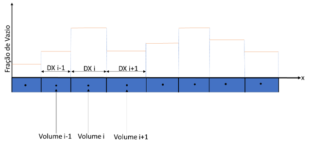

A discretização das equações seguirá a clássica abordagem de volumes finitos com malha desencontrada.

As células com traço cheio são as células em que as leis de conservação de massa e evolução de holdup e beta são resolvidas. Já a célula tracejada é onde a equação de quantidade de movimento é resolvida. A equação de energia é um caso especial, já que é apresentada na sua forma não-conservativa, não faz muito sentido uma abordagem de volumes finitos, neste caso, se utilizará um esquema de diferenças adaptado. Ainda tomando como referência a figura anterior, variáveis como holdup, beta, pressão, temperatura, taxa de transferência de massa, volume de fração leve, densidade de gás, fração de CO2, RGO com escorregamento, fontes de massa, entalpias, fluxo de calor são todas armazenadas nos pontos de índice inteiro. Já as variáveis relacionadas com os fluxos, vazão mássica da mistura, vazão mássica do líquido, vazão mássica do gás, arranjos, parâmetros de escorregamento, velocidades superficiais são avaliadas nas posições de índice fracionário, o que, para o esquema, significa as fronteiras do volume de controle onde se dá o balanço de massa, como no teorema de transporte de Reynolds.

Neste texto, o índice $i$ sempre se referirá à posição no espaço; o índice $k$ ao avanço de tempo, além disto, existe a possibilidade de se escolher um processo iterativo para garantir um avanço completamente implícito do esquema. A maneira como a abordagem numérica foi pensada trabalha com dois ramos, uma metodologia mais simples e mais rápida, em um esquema semi-implícito e uma metodologia mais completa, porém de desempenho pior, com processos iterativos; o processo iterativo é necessário para que se possa incluir no modelo numérico termos que são descartados no esquema mais simples e semi-implícito. Lógico, esta abordagem iterativa termina também sendo uma abordagem implícita. O que a princípio parece ser uma vantagem importante, pois não se tem limitações de incremento de tempo devido ao critério CFL, mas, infelizmente, não é exatamente assim, existem limitações em métodos numéricos para sistemas multifásicos que vão além do que se apresenta em livros textos de métodos numéricos, a limitação, talvez, mais importante está em eventuais, não tão eventuais assim, transições entre condições de escoamento multifásico para escoamentos monofásicos. Estas transições representam verdadeiras singularidades de modelo, algumas decisões devem ser tomadas dentro do código quando estas transições ocorrem e incrementos de tempo muito grandes podem dificultar uma boa transição entre condições de escoamento multifásico para monofásico, em resumo, mesmo em esquemas implícitos, livres das limitações CFL, grandes incrementos de tempo podem não ser aconselháveis em simulações transientes de sistemas multifásicos, neste aspecto, um esquema semi-implícito se torna a abordagem mais adequada. 

## Holdup evolution equation

Seja a discretização da Equação de evolução do holdup:

$$\left[1 - (1-F_w)\frac{R_s \gamma_g \rho_{air}^{std}}{\rho_{lp}B_o}(1-\beta)\right]\frac{\partial(1-\alpha)}{\partial t} =- \frac{1}{A\rho_{lp}}\frac{\partial \dot{M}_p}{\partial x} - \frac{1}{A\rho_{lc}}\left[1-(1-F_w)\frac{R_s \gamma_g \rho_{air}^{std}}{\rho_{lp}B_o}\right]\frac{\partial \dot{M}_c}{\partial x}+ \frac{1}{A\rho_{lp}}\frac{\partial(1-\beta)(1-F_w)\frac{R_s \gamma_g \rho_{air}^{std}}{B_o}Q_l}{\partial x} + \left[1-(1-F_w)\frac{R_s \gamma_g \rho_{air}^{std}}{\rho_{lp}B_o}\right]\frac{\Gamma_{cp}}{A\rho_{lc}\Delta L} + \frac{\Gamma_{lp}}{A\rho_{lp}\Delta L}- \left[\frac{(1-\alpha)(1-\beta)}{\rho_{lp}}\frac{\partial \rho_{lp}}{\partial t} + \frac{(1-\alpha)\beta}{\rho_{lc}}\frac{\partial \rho_{lc}}{\partial t} - \frac{A(1-F_w)}{ A\rho_{lp}}\frac{R_s \gamma_g \rho_{air}^{std}}{B_o}(1-\alpha)\frac{\beta}{\rho_{lc}}\frac{\partial \rho_{lc}}{\partial t} - \frac{A(1-\alpha)(1-\beta)}{A\rho_{lp}}\frac{\partial(1-F_w)\frac{R_s \gamma_g \rho_{air}^{std}}{B_o}}{\partial t}\right] \label{eq:holdup_evolution_final}$$

Caso se considere um esquema semi-implícito, para a maneira como a abordagem está sendo pensada neste trabalho, se deverá descartar os termos finais de derivada no tempo que se encontram no final da equação, à direita, entre colchetes:

$$\begin{equation}
\begin{aligned}
&\frac{\partial(1-\alpha)}{\partial t}
- (1 - F_w)\frac{R_s \gamma_g \rho_{\mathrm{ar}}^{\mathrm{std}}}{\rho_{\mathrm{lp}} B_o}
(1-\beta)\frac{\partial(1-\alpha)}{\partial t}
- (1 - F_w)\frac{R_s \gamma_g \rho_{\mathrm{ar}}^{\mathrm{std}}}{A\rho_{\mathrm{lp}} B_o}
\frac{1}{\rho_{\mathrm{lc}}}\frac{\partial \dot{M}_c}{\partial x} \\[6pt]
&- \frac{1}{A\rho_{\mathrm{lp}}}
\frac{\partial\!\left[(1-\beta)(1-F_w)\dfrac{R_s \gamma_g \rho_{\mathrm{ar}}^{\mathrm{std}}}{B_o} Q_l\right]}{\partial x}
+ (1 - F_w)\frac{R_s \gamma_g \rho_{\mathrm{ar}}^{\mathrm{std}}}{A\rho_{\mathrm{lp}} B_o}
\frac{\Gamma_{\mathrm{cp}}}{\rho_{\mathrm{lc}}\,\Delta L} = \\[6pt]
&\quad - \frac{1}{A\rho_{\mathrm{lp}}}\frac{\partial \dot{M}_p}{\partial x}
- \frac{1}{A\rho_{\mathrm{lc}}}\frac{\partial \dot{M}_c}{\partial x}
+ \frac{\Gamma_{\mathrm{cp}}}{A\rho_{\mathrm{lc}}\,\Delta L}
+ \frac{\Gamma_{\mathrm{lp}}}{A\rho_{\mathrm{lp}}\,\Delta L}
\end{aligned}
\label{eq:holdup_simp}
\end{equation}$$

Neste caso, \eqref{eq:holdup_simp} é uma equação pura de evolução do holdup ou da fração de vazio. O que se verá é muito adequado quando ocorre uma transição entre condições multifásicas/monofásicas. Como já comentado, para a fração de vazio, a maior parte da informação sobre a alteração desta grandeza física é feita por ondas mais lentas, no caso de um modelo drift flux por uma onda que se propaga com velocidade igual à velocidade da fase gás. Sendo assim, a limitação de incremento de tempo CFL para esta equação deve estar na ordem de grandeza $\Delta x/|u_g|$ que é uma limitação bem menos restritivo do que o que se teria com ondas mais rápidas (relacionadas com a propagação da pressão). Em resumo, para \eqref{eq:holdup_simp}, respeitando o critério CFL $\Delta t<\Delta x/|u_g|$, pode-se trabalhar com uma discretização totalmente explícita, o que facilita muito o problema numérico para esta equação. 

Deve-se fazer uma rápida discussão sobre o que vem a ser este critério CFL. Aqui não se pretende apresentar uma explicação matemática rigorosa deste critério, apenas considerações físicas que tornem mais clara a origem desta limitação. O método que se 
está utilizando aqui é o de volumes finitos. No caso do processo de discretização, pode-se admitir que a solução aproximada que se está obtendo, é uma solução contínua de domínio compacto, neste caso, dentro de cada volume, tem-se uma solução contínua para cada grandeza envolvida na modelagem do fenômeno. Mais ainda, esta solução “contínua por volume” é constante em cada volume. Para entender melhor esta maneira de interpretar uma solução discretizada, considere a grandeza fração de vazio em um domínio discretizado:

No volume i, a solução é constante, assim como nos seus volumes vizinhos, a mudança de valor ocorre na sua fronteira. Interpretando desta maneira, isto remete ao problema de Riemann; na verdade enquanto se interpreta o problema como hiperbólico, entre as vizinhanças de volumes, pode-se pensar que o problema evolui como um problema de Riemann por partes durante um certo intervalo de tempo. Em cada volume, se pode pensar, aproximadamente, em velocidades de onda e direções características constantes, originárias do valor constante de cada grandeza dentro do volume e se pode avançar com esta simplificação durante um certo intervalo de tempo (na verdade, existe toda uma classe de volumes finitos que trabalha com esta abordagem, os Riemann Solver, ver Leveque, (2002)). O intervalo de tempo em que a onda pode viajar pelo volume admitindo velocidade de propagação constante e variáveis constantes é o máximo em que se pode usar esta aproximação, quando a onda encontra uma fronteira com um novo valor constante de outro volume, esta aproximação deixa de fazer sentido e os valores de flutuações de cada onda tornam-se fisicamente pouco representativos dentro do outro volume. Ou seja, em um esquema explícito, utilizando-se grandezas já obtidas em um tempo T0, não se deve avançar além do tempo necessário para que uma onda ultrapasse os limites de um volume, de maneira rápida e grosseira, é isto que a condição CFL define.

Considerando o critério CFL para a família de onda mais lenta do modelo drift flux, $\Delta t<\Delta x/|u_g|$, pode-se discretizar \eqref{eq:holdup_simp} de maneira explícita:

$$
\begin{equation}
\alpha_i^{k+1} = \alpha_i^k - \Delta t \,
\dfrac{
  \left\{
  \begin{array}{l}
  \displaystyle
  \left[
    (1-F_w)\frac{R_s \gamma_g \rho_{\mathrm{ar}}^{\mathrm{std}}}{A\rho_{\mathrm{lp}} B_o}
    \frac{1}{\rho_{\mathrm{lc}}}
    - \frac{1}{A\rho_{\mathrm{lc}}}
  \right]_i^k
  \frac{
    {}^{k}\!\dot{M}_c\big|_{i+\frac{1}{2}}
    - {}^{k}\!\dot{M}_c\big|_{i-\frac{1}{2}}
  }{\Delta x\big|_i}
  - \left.\frac{1}{A\rho_{\mathrm{lp}}}\right|_i^k
  \frac{
    {}^{k}\!\dot{M}_p\big|_{i+\frac{1}{2}}
    - {}^{k}\!\dot{M}_p\big|_{i-\frac{1}{2}}
  }{\Delta x\big|_i}
  + \\[12pt]
  \displaystyle
  \left.\frac{1}{A\rho_{\mathrm{lp}}}\right|_i^k
  \frac{
    \left.(1-\beta)(1-F_w)\dfrac{R_s \gamma_g \rho_{\mathrm{ar}}^{\mathrm{std}}}{B_o}
    Q_l\right|_{i+\frac{1}{2}}^{k}
    -
    \left.(1-\beta)(1-F_w)\dfrac{R_s \gamma_g \rho_{\mathrm{ar}}^{\mathrm{std}}}{B_o}
    Q_l\right|_{i-\frac{1}{2}}^{k}
  }{\Delta x\big|_i}
  + \\[12pt]
  \displaystyle
  \left[1-(1-F_w)\frac{R_s \gamma_g \rho_{\mathrm{ar}}^{\mathrm{std}}}{\rho_{\mathrm{lp}} B_o}\right]
  \left.\frac{\Gamma_{\mathrm{cp}}}{A\rho_{\mathrm{lc}}\,\Delta x\big|_i}\right|_i^k
  +
  \left.\frac{\Gamma_{\mathrm{lp}}}{A\rho_{\mathrm{lp}}\,\Delta x\big|_i}\right|_i^k
  \end{array}
  \right\}
}{
  \displaystyle
  \left.\left[
    1-(1-F_w)\frac{R_s \gamma_g \rho_{\mathrm{ar}}^{\mathrm{std}}}{\rho_{\mathrm{lp}} B_o}
    (1-\beta)
  \right]\right|_i^k
}
\label{eq:holdup_ev_disc1}
\end{equation}
$$

A vantagem desta equação de evolução de fração de vazio está no fato de que ela denuncia imediatamente qualquer desrespeito aos limites de fração de vazio, a qual deve estar sempre entre zero e um. Caso, na evolução da fração de vazio, o resultado fique menor que zero ou maior que 1, o incremento de tempo deve ser corrigido para que o valor de fração de vazio não ultrapasse este limite. Como este problema pode ser detectado imediatamente após a evolução da fração de vazio, pode-se corrigir o incremento de tempo antes de se fazer a evolução de outras variáveis, o que poderia penalizar o desempenho do simulador, para se ter esta comodidade, foi necessário eliminar alguns termos da Equação de evolução do holdup \eqref{eq:holdup_evolution_final} como já foi comentado; caso se desejasse um modelo semi-implícito com todos os termos das equações de conservação de massa, a equação de evolução não seria da variável fração de vazio, mas de duas outras variáveis, $\rho_\mathrm{l}\left(1-\alpha\right)$  e $\rho_\mathrm{g}\alpha$, ver Liles & Reed (1978), lógico, para se obter explicitamente o valor da fração de vazio, a partir destas duas variáveis, precisa-se que as grandezas físicas pressão e temperatura já estejam resolvidas no avanço de tempo, ou seja, só se descobrirá se em um avanço de tempo os limites de fração de vazio foram desrespeitados após se evoluir todas as variáveis do problema. Neste caso, a correção de eventuais desrespeitos aos limites de fração de vazio só poderá ser feito após todo o avanço de tempo, algo menos prático do que o que se está propondo em \eqref{eq:holdup_ev_disc1}.

Caso se deseje trabalhar com todos os termos da Equação \eqref{eq:holdup_evolution_final}, deve-se usar um esquema iterativo o que penaliza o desempenho do simulador. Neste caso, o processo se daria tomando como ponto de partida a solução explícita de \eqref{eq:holdup_ev_disc1}, se avançaria na pressão e temperatura, com isto, os termos de derivada temporal dependentes de pressão e temperatura, antes descartadas, podem ser avaliadas e a discretização é similar a \eqref{eq:holdup_ev_disc1}, porém com a adição das derivadas temporais antes descartadas. Ao fim do processo, o método se tornaria totalmente implícito, devido ao processo iterativo. O que foi observado nos testes que foram feitos usando o `Marlim3` é que os termos descartados tem realmente pouca influência no tipo de problema que se deseja estudar. Sendo assim, a partir deste ponto, só se referirá ao esquema de equações simplificadas em uma abordagem semi-implícita.

## $\beta$ evolution equation

Agora consideremos a equação de evolução da fração de fluido complementar $\beta$:

$$
\frac{\partial \beta}{\partial t} = \frac{\Gamma_{cp}}{A(1-\alpha)\rho_{lc}\Delta L} - \frac{\beta}{(1-\alpha)}\frac{\partial(1-\alpha)}{\partial t} - \frac{1}{A(1-\alpha)\rho_{lc}}\frac{\partial \dot{M}_c}{\partial x} - \left(\frac{\beta}{\rho_{lc}}\frac{\partial \rho_{lc}}{\partial t}\right)
\label{eq:beta_evolution_2}
$$

A discretização de \eqref{eq:beta_evolution_2} é dada por:

$$
\begin{equation}
\beta_i^k +
\left\{
  \left.\frac{\beta}{(1-\alpha)}\right|_i^k
  \frac{\alpha_i^{k+1} - \alpha_i^k}{\Delta t}
  - \left.\frac{1}{A(1-\alpha)\rho_{\mathrm{lc}}}\right|_i^k
  \frac{
    \dot{M}_c\big|_{i+\frac{1}{2}}^{k}
    - \dot{M}_c\big|_{i-\frac{1}{2}}^{k}
  }{\Delta x_i}
  + \left.\frac{\Gamma_{\mathrm{cp}}}{A(1-\alpha)\rho_{\mathrm{lc}}\,\Delta x_i}\right|_i^k
\right\}
\label{eq:beta_disc}
\end{equation}
$$

Observe que para se poder fazer a evolução da variável $\beta$ em \eqref{eq:beta_disc}, é necessário já se ter o perfil de fração de vazio obtido para a camada de tempo k, logo, \eqref{eq:beta_disc} só é resolvido após a resolução de \eqref{eq:holdup_ev_disc1}. Da mesma maneira que a fração de vazio, $\beta$ também tem limites que não podem ser extrapolados, a restrição é de que fique sempre entre 0 e 1, logo, correções de incremento de tempo podem ocorrer na evolução desta variável, caso estes limites sejam desrespeitados.

## Acoplamento pressão-velocidade

Resolvido o perfil de $\alpha$ e $\beta$, o próximo passo na resolução do problema é resolver o acoplamento pressão-velocidade. Como já foi comentado, a pressão está intimamente relacionada com as famílias de ondas mais rápidas, que por sua vez estão relacionadas com a compressibilidade dos fluidos. Estas famílias de onda mais rápidas implicam em um critério CFL mais rigoroso, sendo assim, as equações responsáveis pela resolução do acoplamento pressão-velocidade, caso se queira trabalhar com incrementos de tempo menos limitantes para o desempenho do simulador, devem ser resolvidas com um esquema implícito. As equações responsáveis pela resolução do perfil de pressão e de vazão mássica da mistura são:

$$\frac{\alpha}{\rho_g}\left.\frac{\partial \rho_g}{\partial p}\right|_T \frac{\partial p}{\partial t} + \frac{1}{A\rho_g}\frac{\partial (1-T_1)\dot{M}_m - T_2}{\partial x} + \frac{1}{A\rho_{lp}}\frac{\partial \rho_{lp}(1-\beta)\frac{T_1\dot{M}_m+T_2}{\rho_l}}{\partial x} + \frac{1}{A\rho_{lc}}\frac{\partial \rho_{lc}\beta\frac{T_1\dot{M}_m+T_2}{\rho_l}}{\partial x}+ \frac{1}{A}\left(\frac{1}{\rho_g} - \frac{1}{\rho_{lp}}\right)\frac{\partial(1-\beta)(1-F_w)\frac{R_s \gamma_g \rho_{ar}^{std}}{B_o}\frac{T_1\dot{M}_m+T_2}{\rho_l}}{\partial x} =\frac{\Gamma_{lp}}{A\rho_{lp}\Delta L} + \frac{\Gamma_{cp}}{A\rho_{lc}\Delta L} + \frac{\Gamma_g}{A\rho_g\Delta L} - \frac{1}{A}\left(\frac{1}{\rho_g} - \frac{1}{\rho_{lp}}\right)\left[A(1-F_w)\frac{R_s \gamma_g \rho_{ar}^{std}}{B_o}\frac{\partial(1-\alpha)(1-\beta)}{\partial t}\right]-\left[\frac{(1-\alpha)(1-\beta)}{\rho_{lp}}\frac{\partial \rho_{lp}}{\partial t} + \frac{(1-\alpha)\beta}{\rho_{lc}}\frac{\partial \rho_{lc}}{\partial t} + \frac{\alpha}{\rho_g}\left.\frac{\partial \rho_g}{\partial T}\right|_p\frac{\partial T}{\partial t} + \frac{1}{A}\left(\frac{1}{\rho_g} - \frac{1}{\rho_{lp}}\right)A(1-\alpha)(1-\beta)\frac{\partial(1-F_w)\frac{R_s \gamma_g \rho_{ar}^{std}}{B_o}}{\partial t}\right] \label{eq:p_m_acop}
$$

$$
\frac{\partial \dot{M}_g}{\partial t} + A_t \frac{\partial p}{\partial x} = f_m \frac{\rho_m j^2}{2} S_w + \rho_m g A_t \sin(\theta)
\label{eq:simplified_momentum}
$$

A discretização destas equações é apresentada a seguir.

Para a equação \eqref{eq:p_m_acop}:

$$
\begin{equation}
\begin{aligned}
&\frac{1}{\rho_g}\frac{\partial \rho_g}{\partial p}\bigg|_T \bigg|_{i-1}^{k}
  \frac{\alpha_{i-1}^{k+1}}{\Delta t}\, p_{i-1}^{k+1}
+ CT_1\big|_{i-\frac{1}{2}}^{k} \dot{M}_m\big|_{i-\frac{1}{2}}^{k+1}
- CT_1\big|_{i-\frac{3}{2}}^{k} \dot{M}_m\big|_{i-\frac{3}{2}}^{k+1}
\\[6pt]
&+\frac{1}{A}\!\left(\frac{1}{\rho_g}-\frac{1}{\rho_{\mathrm{lp}}}\right)_{i-1}^{k}
  \frac{1}{\Delta x_{i-1}}
  \left[
    \left(1-\beta_{i-\frac{1}{2}}^{k+1}\right)(1-F_w)
    \frac{\partial\frac{R_s}{B_o}}{\partial p}
    \frac{\gamma_g \rho_{\mathrm{ar}}^{\mathrm{std}} T_1}{\rho_l}
    \dot{M}_m\bigg|_{i-\frac{1}{2}}^{k}
    p\big|_{i-\frac{1}{2}}^{k+1}
  \right.\\
&\quad\quad\quad\quad\quad\quad\quad\quad\quad\quad\quad
  \left.
    -\left(1-\beta_{i-\frac{3}{2}}^{k+1}\right)(1-F_w)
    \frac{\partial\frac{R_s}{B_o}}{\partial p}
    \frac{\gamma_g \rho_{\mathrm{ar}}^{\mathrm{std}} T_1}{\rho_l}
    \dot{M}_m\bigg|_{i-\frac{3}{2}}^{k}
    p\big|_{i-\frac{3}{2}}^{k+1}
  \right]
\\[10pt]
&= \frac{1}{\rho_g}\frac{\partial \rho_g}{\partial p}\bigg|_T \bigg|_{i-1}^{k}
  \frac{\alpha_{i-1}^{k+1}}{\Delta t}\, p_{i-1}^{k}
- CT_2\big|_{i-\frac{1}{2}}^{k}
+ CT_2\big|_{i-\frac{3}{2}}^{k}
+ \left(
    \frac{\Gamma_{\mathrm{lp}}}{A\rho_{\mathrm{lp}}\Delta L}
    +\frac{\Gamma_{\mathrm{cp}}}{A\rho_{\mathrm{lc}}\Delta L}
    +\frac{\Gamma_g}{A\rho_g \Delta L}
  \right)_{i-1}^{k}
\\[6pt]
&-\left[\frac{1}{A}\!\left(\frac{1}{\rho_g}-\frac{1}{\rho_{\mathrm{lp}}}\right)
  A(1-F_w)\frac{R_s \gamma_g \rho_{\mathrm{ar}}^{\mathrm{std}}}{B_o}\right]_{i-1}^{k}
  \left[
    \frac{\left(1-\alpha_{i-1}^{k+1}\right)\!\left(1-\beta_{i-1}^{k+1}\right)
         -\left(1-\alpha_{i-1}^{k}\right)\!\left(1-\beta_{i-1}^{k}\right)}
         {\Delta t}
  \right]
\\[6pt]
&+\frac{1}{A}\!\left(\frac{1}{\rho_g}-\frac{1}{\rho_{\mathrm{lp}}}\right)_{i-1}^{k}
  \frac{1}{\Delta x_{i-1}}
  \left[
    \left(1-\beta_{i-\frac{1}{2}}^{k+1}\right)(1-F_w)
    \frac{\partial\frac{R_s}{B_o}}{\partial p}
    \frac{\gamma_g \rho_{\mathrm{ar}}^{\mathrm{std}} T_1}{\rho_l}
    \dot{M}_m\bigg|_{i-\frac{1}{2}}^{k}
    p\big|_{i-\frac{1}{2}}^{k}
  \right.\\
&\quad\quad\quad\quad\quad\quad\quad\quad\quad\quad\quad
  \left.
    -\left(1-\beta_{i-\frac{3}{2}}^{k+1}\right)(1-F_w)
    \frac{\partial\frac{R_s}{B_o}}{\partial p}
    \frac{\gamma_g \rho_{\mathrm{ar}}^{\mathrm{std}} T_1}{\rho_l}
    \dot{M}_m\bigg|_{i-\frac{3}{2}}^{k}
    p\big|_{i-\frac{3}{2}}^{k}
  \right]
\end{aligned}
\label{eq:p_m_acop_disc}
\end{equation}
$$

Onde:

$$\begin{equation}
CT_1\big|_{i-\frac{1}{2}}^{k} = \frac{1}{A\Delta x_{i-1}}
\left[
\begin{array}{l}
\displaystyle
\left.\frac{1}{\rho_g}\right|_{i-1}^{k}
\!\left(1-T_1\right)_{i-\frac{1}{2}}^{k}
+\left.\frac{1}{\rho_{\mathrm{lp}}}\right|_{i-1}^{k}
\!\left(1-\beta_{i-\frac{1}{2}}^{k+1}\right)
\left.\frac{\rho_{\mathrm{lp}}\,T_1}{\rho_l}\right|_{i-\frac{1}{2}}^{k}
+\\[8pt]
\displaystyle
\left.\frac{1}{\rho_{\mathrm{lc}}}\right|_{i-1}^{k}
\beta_{i-\frac{1}{2}}^{k+1}
\left.\frac{\rho_{\mathrm{lc}}\,T_1}{\rho_l}\right|_{i-\frac{1}{2}}^{k}
+\\[8pt]
\displaystyle
\left(\frac{1}{\rho_g}-\frac{1}{\rho_{\mathrm{lp}}}\right)_{i-1}^{k}
\!\left(1-\beta_{i-\frac{1}{2}}^{k+1}\right)(1-F_w)
\left.\frac{R_s\gamma_g\rho_{\mathrm{ar}}^{\mathrm{std}}\,T_1}{B_o\,\rho_l}\right|_{i-\frac{1}{2}}^{k}
\end{array}
\right]
\end{equation}$$

$$\begin{equation}
CT_2\big|_{i-\frac{1}{2}}^{k} = \frac{1}{A\Delta x_{i-1}}
\left[
\begin{array}{l}
\displaystyle
-\left.\frac{1}{\rho_g}\right|_{i-1}^{k}
\!\left(T_2\right)_{i-\frac{1}{2}}^{k}
+\left.\frac{1}{\rho_{\mathrm{lp}}}\right|_{i-1}^{k}
\!\left(1-\beta_{i-\frac{1}{2}}^{k+1}\right)
\left.\frac{\rho_{\mathrm{lp}}\,T_2}{\rho_l}\right|_{i-\frac{1}{2}}^{k}
+\\[8pt]
\displaystyle
\left.\frac{1}{\rho_{\mathrm{lc}}}\right|_{i-1}^{k}
\beta_{i-\frac{1}{2}}^{k+1}
\left.\frac{\rho_{\mathrm{lc}}\,T_2}{\rho_l}\right|_{i-\frac{1}{2}}^{k}
+\\[8pt]
\displaystyle
\left(\frac{1}{\rho_g}-\frac{1}{\rho_{\mathrm{lp}}}\right)_{i-1}^{k}
\!\left(1-\beta_{i-\frac{1}{2}}^{k+1}\right)(1-F_w)
\left.\frac{R_s\gamma_g\rho_{\mathrm{ar}}^{\mathrm{std}}\,T_2}{B_o\,\rho_l}\right|_{i-\frac{1}{2}}^{k}
\end{array}
\right]
\end{equation}$$

$$\begin{equation}
CT_1\big|_{i-\frac{3}{2}}^{k} = \frac{1}{A\Delta x_{i-1}}
\left[
\begin{array}{l}
\displaystyle
\left.\frac{1}{\rho_g}\right|_{i-1}^{k}
\!\left(1-T_1\right)_{i-\frac{3}{2}}^{k}
+\left.\frac{1}{\rho_{\mathrm{lp}}}\right|_{i-1}^{k}
\!\left(1-\beta_{i-\frac{3}{2}}^{k+1}\right)
\left.\frac{\rho_{\mathrm{lp}}\,T_1}{\rho_l}\right|_{i-\frac{3}{2}}^{k}
+\\[8pt]
\displaystyle
\left.\frac{1}{\rho_{\mathrm{lc}}}\right|_{i-1}^{k}
\beta_{i-\frac{3}{2}}^{k+1}
\left.\frac{\rho_{\mathrm{lc}}\,T_1}{\rho_l}\right|_{i-\frac{3}{2}}^{k}
+\\[8pt]
\displaystyle
\left(\frac{1}{\rho_g}-\frac{1}{\rho_{\mathrm{lp}}}\right)_{i-1}^{k}
\!\left(1-\beta_{i-\frac{3}{2}}^{k+1}\right)(1-F_w)
\left.\frac{R_s\gamma_g\rho_{\mathrm{ar}}^{\mathrm{std}}\,T_1}{B_o\,\rho_l}\right|_{i-\frac{3}{2}}^{k}
\end{array}
\right]
\end{equation}$$

$$\begin{equation}
CT_2\big|_{i-\frac{3}{2}}^{k} = \frac{1}{A\Delta x_{i-1}}
\left[
\begin{array}{l}
\displaystyle
-\left.\frac{1}{\rho_g}\right|_{i-1}^{k}
\!\left(T_2\right)_{i-\frac{3}{2}}^{k}
+\left.\frac{1}{\rho_{\mathrm{lp}}}\right|_{i-1}^{k}
\!\left(1-\beta_{i-\frac{3}{2}}^{k+1}\right)
\left.\frac{\rho_{\mathrm{lp}}\,T_2}{\rho_l}\right|_{i-\frac{3}{2}}^{k}
+\\[8pt]
\displaystyle
\left.\frac{1}{\rho_{\mathrm{lc}}}\right|_{i-1}^{k}
\beta_{i-\frac{3}{2}}^{k+1}
\left.\frac{\rho_{\mathrm{lc}}\,T_2}{\rho_l}\right|_{i-\frac{3}{2}}^{k}
+\\[8pt]
\displaystyle
\left(\frac{1}{\rho_g}-\frac{1}{\rho_{\mathrm{lp}}}\right)_{i-1}^{k}
\!\left(1-\beta_{i-\frac{3}{2}}^{k+1}\right)(1-F_w)
\left.\frac{R_s\gamma_g\rho_{\mathrm{ar}}^{\mathrm{std}}\,T_2}{B_o\,\rho_l}\right|_{i-\frac{3}{2}}^{k}
\end{array}
\right]
\end{equation}$$

Alguns pontos devem ser observados nesta algebrização. As derivadas espaciais da vazão mássica da mistura foram implicitadas para esta variável, mas os termos nesta derivada que são dependentes da pressão são tratadas de maneira explícita, por exemplo, as massas específicas nestas derivadas são calculadas com as variáveis na camada de tempo k e não k+1. Mas existe uma exceção, a derivada $\frac{\partial\left(1-\beta\right)\left(1-F_w\right)\frac{R_s\gamma_g\rho_{\mathrm{ar}}^{\mathrm{std}}}{B_o}\frac{T_1{\dot{M}}_m+T_2}{\rho_l}}{\partial x}$  na Equação \eqref{eq:p_m_acop}; esta derivada tem sua origem dos termos de transferência de massa entre as fases, foi observado que o acoplamento ganha em estabilidade quando alguma implicitação na pressão é aplicada nesta derivada, isto é feito na razão $\frac{R_s}{B_o}$, neste caso, se trabalhará com a seguinte expansão em série de Taylor de primeira ordem $\left.\frac{R_s}{B_o}\right|_{i-\frac{1}{2}}^{k+1}=\left.\frac{R_s}{B_o}\right|_{i-\frac{1}{2}}^k+\left.\frac{\partial\frac{R_s}{B_o}}{\partial p}\right|_{i-\frac{1}{2}}^k\left(p_{i-\frac{1}{2}}^{k+1}-p_{i-\frac{1}{2}}^k\right)$. Isto melhora a estabilidade do acoplamento, mas traz uma nova dificuldade. A pressão que é resolvida no acoplamento é a pressão no centro de volume, agora se tem a adição de uma pressão de fronteira que também está implicitada, deve-se ter uma expressão para esta pressão de fronteira em termos da pressão de centro de volume. Uma maneira simples é usar os termos de variação de pressão por hidrostática e perda por fricção para se fazer uma estimativa desta pressão de fronteira em termos das pressões de centro de volume:

$$\begin{equation}
\begin{aligned}
p_{i-\frac{1}{2}}^{k+1} &= 0.5\!\left(p_i^{k+1} + p_{i-1}^{k+1}\right)
+ 0.5\!\left(
    \rho_m\big|_i^k\, g\,\frac{\Delta x_i}{2}\,\mathrm{sen}(\theta_i)
  - \rho_m\big|_{i-1}^k\, g\,\frac{\Delta x_{i-1}}{2}\,\mathrm{sen}(\theta_{i-1})
  \right) \\[8pt]
&+ 0.5\!\left(
    \rho_m\big|_{i-1}^k f_{i-1}^k \frac{S_{i-1}}{A_{i-1}}\frac{\Delta x_{i-1}}{2}
  - \rho_m\big|_i^k f_i^k \frac{S_i}{A_i}\frac{\Delta x_i}{2}
  \right)
  \frac{
    \left|\, j_{i-\frac{1}{2}}^k \,\right| j_{i-\frac{1}{2}}^k
  }{2}
= \frac{p_i^{k+1}}{2} + \frac{p_{i-1}^{k+1}}{2}
+ \left.\mathit{correction}\right|_{i-\frac{1}{2}}^{k}
\end{aligned}
\label{eq:estim_press}
\end{equation}$$

A Equação \eqref{eq:estim_press} é uma maneira de se abordar este problema, porém, mesmo esta abordagem pode ser problemática, principalmente em problemas de segregação lenta. Observe que a conexão entre a pressão de fronteira e a pressão de centro de volume ainda é dependente de termos na camada de tempo k, o que dá uma certa explicitude nesta relação, em processos de segregação lenta, observa-se instabilidades por conta disto (ao menos acredita-se que seja por conta disto), a solução nestas situações é simplesmente descartar esta correção. No `Marlim3` existe a possibilidade de se “ligar” ou desligar este termo.

Com isto:

$$
\begin{equation}
\begin{aligned}
&\frac{1}{\rho_g}\frac{\partial \rho_g}{\partial p}\bigg|_T \bigg|_{i-1}^{k}
  \frac{\alpha_{i-1}^{k+1}}{\Delta t}\, p_{i-1}^{k+1} \\[6pt]
&+\frac{1}{2}\frac{1}{A}\!\left(\frac{1}{\rho_g}-\frac{1}{\rho_{\mathrm{lp}}}\right)_{i-1}^{k}
  \frac{1}{\Delta x_{i-1}}
  \left[
  \begin{array}{l}
  \displaystyle
    \left(1-\beta_{i-\frac{1}{2}}^{k+1}\right)(1-F_w)
    \frac{\partial\frac{R_s}{B_o}}{\partial p}
    \frac{\gamma_g \rho_{\mathrm{ar}}^{\mathrm{std}}\,T_1}{\rho_l}
    \dot{M}_m\bigg|_{i-\frac{1}{2}}^{k}
    \!\left(p\big|_i^{k+1}+p\big|_{i-1}^{k+1}\right) \\[10pt]
  \displaystyle
    -\left(1-\beta_{i-\frac{3}{2}}^{k+1}\right)(1-F_w)
    \frac{\partial\frac{R_s}{B_o}}{\partial p}
    \frac{\gamma_g \rho_{\mathrm{ar}}^{\mathrm{std}}\,T_1}{\rho_l}
    \dot{M}_m\bigg|_{i-\frac{3}{2}}^{k}
    \!\left(p\big|_{i-1}^{k+1}+p\big|_{i-2}^{k+1}\right)
  \end{array}
  \right] \\[6pt]
&+ CT_1\big|_{i-\frac{1}{2}}^{k}\,\dot{M}_m\big|_{i-\frac{1}{2}}^{k+1}
  - CT_1\big|_{i-\frac{3}{2}}^{k}\,\dot{M}_m\big|_{i-\frac{3}{2}}^{k+1} \\[10pt]
&= \frac{1}{\rho_g}\frac{\partial \rho_g}{\partial p}\bigg|_T \bigg|_{i-1}^{k}
  \frac{\alpha_{i-1}^{k+1}}{\Delta t}\, p_{i-1}^{k}
  - CT_2\big|_{i-\frac{1}{2}}^{k}
  + CT_2\big|_{i-\frac{3}{2}}^{k}
  + \left(
      \frac{\Gamma_{\mathrm{lp}}}{A\rho_{\mathrm{lp}}\Delta L}
      +\frac{\Gamma_{\mathrm{cp}}}{A\rho_{\mathrm{lc}}\Delta L}
      +\frac{\Gamma_g}{A\rho_g\Delta L}
    \right)_{i-1}^{k} \\[6pt]
&- \left[\frac{1}{A}\!\left(\frac{1}{\rho_g}-\frac{1}{\rho_{\mathrm{lp}}}\right)
    A(1-F_w)\frac{R_s\gamma_g\rho_{\mathrm{ar}}^{\mathrm{std}}}{B_o}
  \right]_{i-1}^{k}
  \left[
    \frac{\left(1-\alpha_{i-1}^{k+1}\right)\!\left(1-\beta_{i-1}^{k+1}\right)
         -\left(1-\alpha_{i-1}^{k}\right)\!\left(1-\beta_{i-1}^{k}\right)}
         {\Delta t}
  \right] \\[6pt]
&+\frac{1}{A}\!\left(\frac{1}{\rho_g}-\frac{1}{\rho_{\mathrm{lp}}}\right)_{i-1}^{k}
  \frac{1}{\Delta x_{i-1}}
  \left[
  \begin{array}{l}
  \displaystyle
    \left(1-\beta_{i-\frac{1}{2}}^{k+1}\right)(1-F_w)
    \frac{\partial\frac{R_s}{B_o}}{\partial p}
    \frac{\gamma_g \rho_{\mathrm{ar}}^{\mathrm{std}}\,T_1}{\rho_l}
    \dot{M}_m\bigg|_{i-\frac{1}{2}}^{k}
    \!\left(p\big|_{i-\frac{1}{2}}^{k}
    -\left.\mathit{correction}\right|_{i-\frac{1}{2}}^{k}\right) \\[10pt]
  \displaystyle
    -\left(1-\beta_{i-\frac{3}{2}}^{k+1}\right)(1-F_w)
    \frac{\partial\frac{R_s}{B_o}}{\partial p}
    \frac{\gamma_g \rho_{\mathrm{ar}}^{\mathrm{std}}\,T_1}{\rho_l}
    \dot{M}_m\bigg|_{i-\frac{3}{2}}^{k}
    \!\left(p\big|_{i-\frac{3}{2}}^{k}
    -\left.\mathit{correction}\right|_{i-\frac{3}{2}}^{k}\right)
  \end{array}
  \right]
\end{aligned}
\label{eq:p_m_acop_disc2}
\end{equation}
$$

Um comentário deve ser feito sobre os termos de fonte de massa, pela Equação \eqref{eq:p_m_acop_disc2} são todos calculados na camada de tempo k, sendo portanto calculado de maneira explícita, porém, existe um tipo de fonte onde isto é desaconselhável, fontes de massa do tipo IPR, neste caso, a fonte de massa torna-se dependente da pressão do volume, para índices de produtividade grandes, típicos de poços do pré-sal, esta dependência, tratada de maneira explícita, pode levar a instabilidades no sistema, sendo assim, apenas para a Equação \eqref{eq:p_m_acop_disc2}, fontes de massa do tipo IPR são tratadas por meio de uma expansão de série de Taylor para que possa ter um certo nível de “implicitude”:

$$
\mathrm{\Gamma}=\texttt{IPR}\left(p\right)=\texttt{IPR}\left(p^k\right)+\left.\frac{\partial \texttt{IPR}\left(p\right)}{\partial p}\right|^k\left(p^{k+1}-p^k\right)
$$

Deve-se observar que para a obtenção das pressões na fronteira a partir das variáveis de volume, utilizou-se ou correções de perda de carga ou meramente relações médias, isto é razoável para a pressão, pois, como se está trabalhando com uma solução implícita para a pressão e os incrementos de tempo não buscam capturar famílias de onda mais relacionadas com esta grandeza, o enfoque passa a ser o de uma resolução de problema elíptico, porém, para outras grandezas na fronteira, esta abordagem não é adequada e pode arruinar a simulação. Por exemplo, os termos T1 e T2 são termos de fronteira e dependem da fração de vazio. Aqui, deve-se ter um cuidado especial, o avanço de tempo é feito para se capturar a família de onda que efetivamente transporta esta grandeza e a resolução da equação de evolução desta grandeza é explícita. Deve-se, portanto, verificar como esta família de onda é transporta a fração de vazio. Isto, por sorte, é muito simples, como já foi dito a família de onda relacionada com a velocidade do gás, para definir qual valor de fração de vazio usar na fronteira, basta verificar o sentido da velocidade de gás. Por exemplo, na figura a seguir, a fração de vazio da fronteira $i+1/2$ deve ser igual à fração do volume $i$, pois este é o sentido de transporte desta grandeza.

Da mesma maneira, para se determinar qual a temperatura de fronteira, utiliza-se a velocidade de advecção de temperatura, $\frac{\rho_g\alpha u_gc_{pg}+\rho_l\left(1-\alpha\right)u_lc_{pl}}{\rho_g\alpha c_{vg}^\prime+\rho_l\left(1-\alpha\right)c_{vl}}$.

Para a quantidade de movimento, o volume utilizado é o representado pelas linhas tracejadas na discretização da figura do início desta seção. A equação discretizada é apresentada a seguir:

$$\begin{equation}
\begin{aligned}
&\frac{
  \left(1-T_1\big|_{i+\frac{1}{2}}^{k}\right)\dot{M}_m\big|_{i+\frac{1}{2}}^{k+1}
  - T_2\big|_{i+\frac{1}{2}}^{k}\,\dot{M}_g\big|_{i+\frac{1}{2}}^{k}
}{\Delta t}
+ A\,\frac{p_{i+1}^{k+1}-p_i^{k+1}}{\Delta x}
= \frac{\Delta x_i}{\Delta x_i + \Delta x_{i+1}}
\left\{
  f_{m_i}^{\,k}\frac{\rho_m\big|_i}{2}\frac{S_w\big|_i}{A^2\big|_i}
  \left|\frac{\dot{M}_g\big|_{i+\frac{1}{2}}^{k}}{\rho_g\big|_i^k}\right|
\right. \\[8pt]
&+\frac{\dot{M}_l\big|_{i+\frac{1}{2}}^{k}}{\rho_l\big|_i^k}
  \left[
    \frac{
      \left(1-T_1\big|_{i+\frac{1}{2}}^{k}\right)\dot{M}_m\big|_{i+\frac{1}{2}}^{k+1}
      - T_2\big|_{i+\frac{1}{2}}^{k}\,\dot{M}_g\big|_{i+\frac{1}{2}}^{k}
    }{\rho_g\big|_i^k}
    +\frac{
      T_1\big|_{i+\frac{1}{2}}^{k}\,\dot{M}_m\big|_{i+\frac{1}{2}}^{k+1}
      + T_2\big|_{i+\frac{1}{2}}^{k}
    }{\rho_l\big|_i^k}
  \right]
  + \rho_m\big|_i\, g\, A\sin(\theta_i)
\left.\vphantom{\frac{1}{2}}\right\} \\[8pt]
&+ \frac{\Delta x_{i+1}}{\Delta x_i + \Delta x_{i+1}}
\left\{
  f_{m_{i+1}}^{\,k}\frac{\rho_m\big|_{i+1}}{2}\frac{S_w\big|_{i+1}}{A^2\big|_{i+1}}
  \left|\frac{\dot{M}_g\big|_{i+\frac{1}{2}}^{k}}{\rho_g\big|_{i+1}^k}\right|
  +\frac{\dot{M}_l\big|_{i+\frac{1}{2}}^{k}}{\rho_l\big|_{i+1}^k}
  \left[
    \frac{
      \left(1-T_1\big|_{i+\frac{1}{2}}^{k}\right)\dot{M}_m\big|_{i+\frac{1}{2}}^{k+1}
      - T_2\big|_{i+\frac{1}{2}}^{k}\,\dot{M}_g\big|_{i+\frac{1}{2}}^{k}
    }{\rho_g\big|_{i+1}^k}
  \right.
\right. \\[8pt]
&\quad\quad\quad\quad\quad\quad\quad\quad
  \left.\left.
    +\frac{
      T_1\big|_{i+\frac{1}{2}}^{k}\,\dot{M}_m\big|_{i+\frac{1}{2}}^{k+1}
      + T_2\big|_{i+\frac{1}{2}}^{k}
    }{\rho_l\big|_{i+1}^k}
  \right]
  + \rho_m\big|_{i+1}\, g\, A\sin(\theta_{i+1})
\right\}
\end{aligned}
\label{eq:momentum_disc}
\end{equation}$$

Onde:

$$\left.\rho_m\right|_i=\left(1-\alpha_i^{k+1}\right)\left.\rho_l\right|_i^k+\alpha_i^{k+1}\left.\rho_g\right|_i^k$$

$$\left.\rho_m\right|_{i+1}=\left(1-\alpha_{i+1}^{k+1}\right)\left.\rho_l\right|_{i+1}^k+\alpha_{i+1}^{k+1}\left.\rho_g\right|_{i+1}^k$$		

Uma observação sobre a equação de quantidade de movimento algebrizada \eqref{eq:momentum_disc}, foi necessário implicitar parte do termo de perda de carga por fricção. Isto se deve ao fato de que este é um termo fonte relevante na escala de tempo em que o fenômeno avança; nesta escala de tempo, é provável que os termos dinâmicos sejam pouco relevantes e o perfil de pressão tenha um comportamento próximo de uma solução elíptica em que os termos de perda de carga por fricção são muito relevantes, portanto, fazer o acoplamento pressão-velocidade sem dar algum grau de “implicitude” a este termo pode ser danoso à simulação.

Considerando:

$$\begin{equation}
CM_g\big|_i = \frac{1}{\rho_g\big|_i^k}
\frac{\Delta x_i}{\Delta x_i + \Delta x_{i+1}}
f_{m_i}^{\,k}
\frac{\rho_m\big|_i}{2}
\frac{S_w\big|_i}{A^2\big|_i}
\left|
  \frac{\dot{M}_g\big|_{i+\frac{1}{2}}^{k}}{\rho_g\big|_i^k}
  + \frac{\dot{M}_l\big|_{i+\frac{1}{2}}^{k}}{\rho_l\big|_i^k}
\right|
\end{equation}
$$

$$\begin{equation}
CM_l\big|_i = \frac{1}{\rho_l\big|_i^k}
\frac{\Delta x_i}{\Delta x_i + \Delta x_{i+1}}
f_{m_i}^{\,k}
\frac{\rho_m\big|_i}{2}
\frac{S_w\big|_i}{A^2\big|_i}
\left|
  \frac{\dot{M}_g\big|_{i+\frac{1}{2}}^{k}}{\rho_g\big|_i^k}
  + \frac{\dot{M}_l\big|_{i+\frac{1}{2}}^{k}}{\rho_l\big|_i^k}
\right|
\end{equation}$$

$$\begin{equation}
CM_g\big|_{i+1} = \frac{1}{\rho_g\big|_{i+1}^k}
\frac{\Delta x_{i+1}}{\Delta x_i + \Delta x_{i+1}}
f_{m_{i+1}}^{\,k}
\frac{\rho_m\big|_{i+1}}{2}
\frac{S_w\big|_{i+1}}{A^2\big|_{i+1}}
\left|
  \frac{\dot{M}_g\big|_{i+\frac{1}{2}}^{k}}{\rho_g\big|_{i+1}^k}
  + \frac{\dot{M}_l\big|_{i+\frac{1}{2}}^{k}}{\rho_l\big|_{i+1}^k}
\right|
\end{equation}$$

$$\begin{equation}
CM_l\big|_{i+1} = \frac{1}{\rho_l\big|_{i+1}^k}
\frac{\Delta x_{i+1}}{\Delta x_i + \Delta x_{i+1}}
f_{m_{i+1}}^{\,k}
\frac{\rho_m\big|_{i+1}}{2}
\frac{S_w\big|_{i+1}}{A^2\big|_{i+1}}
\left|
  \frac{\dot{M}_g\big|_{i+\frac{1}{2}}^{k}}{\rho_g\big|_{i+1}^k}
  + \frac{\dot{M}_l\big|_{i+\frac{1}{2}}^{k}}{\rho_l\big|_{i+1}^k}
\right|
\end{equation}$$

Pode-se reorganizar \eqref{eq:momentum_disc}:

$$\begin{equation}
\begin{aligned}
&\left\{
  \left[
    \frac{1}{\Delta t} - CM_g\big|_i - CM_g\big|_{i+1}
  \right]
  \left(1 - T_1\big|_{i+\frac{1}{2}}^{k}\right)
  - \left(CM_l\big|_i + CM_l\big|_{i+1}\right)
  T_1\big|_{i+\frac{1}{2}}^{k}
\right\}
\dot{M}_m\big|_{i+\frac{1}{2}}^{k+1}
+ \frac{A}{\Delta x}\,p_{i+1}^{k+1}
- \frac{A}{\Delta x}\,p_i^{k+1} = \\[8pt]
&\left(
  \frac{1}{\Delta t}
  - CM_g\big|_i
  + CM_l\big|_i
  - CM_g\big|_{i+1}
  + CM_l\big|_{i+1}
\right)
T_2\big|_{i+\frac{1}{2}}^{k}
+ \frac{\dot{M}_g\big|_{i+\frac{1}{2}}^{k}}{\Delta t}
+ \frac{\Delta x_i}{\Delta x_i + \Delta x_{i+1}}\,\rho_m\big|_i\, g\, A\sin(\theta_i) \\[8pt]
&+ \frac{\Delta x_{i+1}}{\Delta x_i + \Delta x_{i+1}}\,\rho_m\big|_{i+1}\, g\, A\sin(\theta_{i+1})
\end{aligned}
\end{equation}
$$

Com isto, tem-se o par de equações algebrizadas com as quais o domínio discretizado é mapeado fazendo o acoplamento pressão-velocidade. Os dois volumes utilizados para este par de equações foram: volume $i-1$ para a conservação da massa da mistura e volume $i-1/2$ (volume tracejado) para a quantidade de movimento. Uma questão curiosa nesta algebrização é que estes dois volumes não são adjacentes, estão distantes um do outro por meio volume; mesmo assim, esta é melhor maneira de se montar o acoplamento, pois desta maneira, os termos que se encontrarão na diagonal da matriz global em que se resolve o problema não correm o risco de terem seu valor anulados em alguma eventual mudança de modelo multifásico para monofásico. Isto ficará mais claro quando for discutida a estrutura da matriz global deste problema. Agora, se limitará a observar que este par de equações forma uma matriz local que será depois realocada numa matriz global. Esta matriz local guarda as relações vinculadas ao par $\left(\dot{M}_m\big|_{i-\frac{1}{2}}^{k+1},\, p_i^{k+1}\right)$, esta será a matriz de índice $i$ do ponto de vista da matriz global:

$$\begin{equation}
\begin{bmatrix}
m_{0,0} & m_{0,1} & m_{0,2} & m_{0,3} & m_{0,4} & 0       & 0       \\
0       & 0       & 0       & 0       & m_{1,4} & m_{1,5} & m_{1,6}
\end{bmatrix}_i
\begin{bmatrix}
p_{i-2}^{k+1} \\[4pt]
\dot{M}_m\big|_{i-\frac{3}{2}}^{k+1} \\[4pt]
p_{i-1}^{k+1} \\[4pt]
\dot{M}_m\big|_{i-\frac{1}{2}}^{k+1} \\[4pt]
p_i^{k+1} \\[4pt]
\dot{M}_m\big|_{i+\frac{1}{2}}^{k+1} \\[4pt]
p_{i+1}^{k+1}
\end{bmatrix}
=
\begin{bmatrix}
tl_0 \\[4pt]
tl_1
\end{bmatrix}_i
\end{equation}
$$

De posse desta matriz local de índice $i$, deve-se fazer o “assembly” na matriz global. Este “assembly” é relativamente simples, pois a discretização é estruturada, como é inevitável em um domínio unidimensional, o resultado da matriz global é uma matriz banda com 3 termos a direita da diagonal principal e 4 termos a esquerda da diagonal principal:

$$\begin{equation}
\begin{bmatrix}
& & & \vdots & & & & \\
\cdots & m_{2i-1,2i-4} & m_{2i-1,2i-3} & m_{2i-1,2i-2} & m_{2i-1,2i-1} & m_{2i-1,2i} & 0 & 0 & \cdots \\
\cdots & 0 & 0 & 0 & 0 & m_{2i,2i} & m_{2i,2i+1} & m_{2i,2i} & \cdots \\
& & & \vdots & & & &
\end{bmatrix}
\begin{bmatrix}
\vdots \\[4pt]
p_{i-2}^{k+1} \\[4pt]
\dot{M}_m\big|_{i-\frac{3}{2}}^{k+1} \\[4pt]
p_{i-1}^{k+1} \\[4pt]
\dot{M}_m\big|_{i-\frac{1}{2}}^{k+1} \\[4pt]
p_i^{k+1} \\[4pt]
\dot{M}_m\big|_{i+\frac{1}{2}}^{k+1} \\[4pt]
p_{i+1}^{k+1} \\[4pt]
\vdots
\end{bmatrix}
=
\begin{bmatrix}
\vdots \\[4pt]
tl_{2i-1} \\[4pt]
tl_{2i} \\[4pt]
\vdots
\end{bmatrix}
\end{equation}$$

Em uma forma esquemática, ter-se-ia uma matriz global com o seguinte aspecto:

$$\begin{equation}
\left[
\begin{array}{ccccccccccccccccccccc}
 &  &  &  &  &  &  &  &  &  & \vdots &  &  &  &  &  &  &  &  &  &  \\
0 & 0 & x & x & x & x & D & x & x & x & 0 & 0 & 0 & 0 & 0 & 0 & 0 & 0 & 0 & 0 & 0 \\
0 & 0 & 0 & x & x & x & x & D & x & x & x & 0 & 0 & 0 & 0 & 0 & 0 & 0 & 0 & 0 & 0 \\
0 & 0 & 0 & 0 & x & x & x & x & D & x & x & x & 0 & 0 & 0 & 0 & 0 & 0 & 0 & 0 & 0 \\
0 & 0 & 0 & 0 & 0 & x & x & x & x & D & x & x & x & 0 & 0 & 0 & 0 & 0 & 0 & 0 & 0 \\
\cdots & 0 & 0 & 0 & 0 & 0 & x & x & x & x & D & x & x & x & 0 & 0 & 0 & 0 & 0 & 0 & \cdots \\
0 & 0 & 0 & 0 & 0 & 0 & 0 & x & x & x & x & D & x & x & x & 0 & 0 & 0 & 0 & 0 & 0 \\
0 & 0 & 0 & 0 & 0 & 0 & 0 & 0 & x & x & x & x & D & x & x & x & 0 & 0 & 0 & 0 & 0 \\
0 & 0 & 0 & 0 & 0 & 0 & 0 & 0 & 0 & x & x & x & x & D & x & x & x & 0 & 0 & 0 & 0 \\
0 & 0 & 0 & 0 & 0 & 0 & 0 & 0 & 0 & 0 & x & x & x & x & D & x & x & x & 0 & 0 & 0 \\
0 & 0 & 0 & 0 & 0 & 0 & 0 & 0 & 0 & 0 & 0 & x & x & x & x & D & x & x & x & 0 & 0 \\
 &  &  &  &  &  &  &  &  &  & \vdots &  &  &  &  &  &  &  &  &  &
\end{array}
\right]
\end{equation}$$

Para finalizar a questão do acoplamento pressão-velocidade, deve-se atentar para alguns detalhes na obtenção dos termos $T_1$ e $T_2$, quando a fronteira do volume se encontra em uma situação de mudança de arranjo de fase ou mudança de condição multifásica para condição monofásica, estes são problemas delicados no simulador. $T_1$ e $T_2$ são dois termos que determinam quanto da vazão mássica da mistura de fluidos é uma vazão mássica de líquido ou uma vazão mássica de gás. Estes termos são sempre calculados na fronteira dos volumes de conservação de massa. Pelas equações $T_1 = \frac{1-\alpha C_0}{1-\alpha C_0\left(1-\frac{\rho_g}{\rho_l}\right)}$ e $T_2 = -\frac{\alpha A u_d \rho_g}{1-\alpha C_0\left(1-\frac{\rho_g}{\rho_l}\right)}$, obtidas na derivação das equações de balanço de massa e quantidade de movimento, estes dois termos são fáceis de se calcular, as equações são simples, basta apenas que se tenha os parâmetros necessários nestas fronteiras. $T_1$ e $T_2$  têm uma relação importante com os parâmetros de escorregamento, é interessante observar que em um módulo de cálculo permanente, os parâmetros de escorregamento são utilizados para o cálculo da fração de vazio, já no módulo transiente, estes mesmos parâmetros são utilizados para determinar o quanto da vazão mássica da mistura é vazão de gás ou de líquido. Os parâmetros de escorregamento são dependentes dos arranjos de fases e a depender das correlações utilizadas e do arranjo envolvido, estes parâmetros de escorregamento podem ser muito distintos o que leva a valores $T_1$ e $T_2$ também distintos de um arranjo para outro. Em processos transientes, a mudança de arranjo podem ocorrer de uma camada de tempo para outra, estas mudanças podem levar a mudanças importantes nos valores de $T_1$ e $T_2$, a depender destas variações, o simulador pode ser lançado em uma situação instável e cíclico de mudança de arranjo de fases, em que em cada camada de tempo se é indicado um arranjo de fases diferente; para se evitar esta ciclagem de arranjos à medida em se avança no tempo, a transição dos parâmetros de escorregamento devem ser feitos de maneira suavizada, deve-se evitar uma mudança abrupta de parâmetros de escorregamento em um passo de tempo, esta suavização é feita de maneira heurística, em geral, no simulador, uma transição de arranjo só é completada após cerca de 20 passos de tempo, o que vem demonstrando suficiente para evitar este processo de ciclagem de arranjos. Excluindo esta dificuldade relacionada com mudanças de arranjo de fase, a determinação de $T_1$ e $T_2$ em uma situação de escoamento bifásico é trivial. Porém, observando as relações de $T_1$ e $T_2$ verifica-se que elas só fazem sentido enquanto se tem garantido um escoamento multifásico na fronteira do volume, as relações em si não são capazes de indicar que o fluxo na fronteira é um fluxo monofásico de gás ou de líquido, em outras palavras, não é uma decisão natural ou transparente determinar quando o fluxo em uma fronteira de volume é monofásico ou multifásico, para tanto, no código do simulador, foi necessário criar mais outra heurística para a tomada de decisão sobre esta questão. Duas situações, claro, são relativamente fáceis de determinar se o escoamento é multifásico ou monofásico na fronteira. A primeira é quando dois volumes adjacentes têm frações de vazio diferentes de 1 e de zero, neste caso, o fluxo na fronteira será multifásico; a segunda situação é quando os dois volumes adjacentes têm, ao mesmo tempo fração de vazio = 1, fluxo de gás na fronteira, ou os dois têm fração de vazio = 0, fluxo de líquido na fronteira.

Infelizmente, não é sempre tão óbvio se tomar esta decisão e isto pode ser um desafio para o simulador, principalmente em processos de segregação de fluidos a baixa velocidade. Considere a seguinte situação:

Esta é uma situação não tão incomum de ocorrer em um processo de parada de produção. A decisão se um fluxo em uma fronteira é bifásico ou monofásico é feita com informações da camada de tempo k, anterior ao avanço do passo de tempo, esta decisão é uma das mais importantes para a conservação de massa e acoplamento pressão-velocidade, para se ter uma previsão correta, teria de se ter um esquema implícito, a partir de métodos iterativos, o que se está evitando neste simulador. No caso da Figura (23) o gás está parado, porém existe líquido atravessando a fronteira, como este líquido tem velocidade negativa e vem de um volume em condição bifásica, é razoável admitir que o fluxo na fronteira é bifásico, se ao contrário, a velocidade do líquido fosse positiva, seria mais razoável admitir que o fluxo na fronteira é apenas de gás. Neste ponto, pode-se verificar um desafio para o simulador; em condições em que a velocidade de líquido é pequena, próxima de zero, típico de situações de parada de produção, em um avanço de tempo frequentemente a velocidade de uma das fases muda de sentido e a decisão que foi tomada com dados do tempo anterior se demonstrará incorreta. Por exemplo, no caso da Figura 23, se indicou um fluxo bifásico, mas se no avanço de tempo, a velocidade de líquido mudou de sentido, talvez o mais correto teria sido indicar fluxo monofásico de gás. Isto pode incorrer em um erro na conservação de massa, pode-se gerar massa de líquido ou massa de gás por conta de uma decisão equivocada como esta. Isto não é um problema grave, se eventual, mas em processos longos de parada de produção, erros deste tipo podem se tornar frequentes e arruinar a simulação. Casos de parada de produção, ou shut in, tem duas características que dificultam estas decisões sobre a natureza do fluxo na fronteira de volumes; um processo longo de segregação com vários volumes adjacentes com condições dúbias sobre qual o tipo de fluxo na fronteira, baixas velocidades de escoamento, tornando comum a mudança de sentido do escoamento de uma fase em um avanço de tempo, dificultando a previsão da natureza do fluxo na fronteira. A solução para isto, além, claro, de se ter uma heurística adequada, é limitar o avanço de tempo; em paradas, o incremento de tempo pode, a priori, ser feito com valores grandes, pois as velocidades de escoamento são baixas, relaxando assim o critério CFL, mas quando estes incrementos de tempo se tornam grandes em processos com velocidades próximas de zero, o risco da velocidade da fase no avanço de tempo mudar de sentido é grande, causando erros na previsão do fluxo, gerando inclusive geração de massa, o que pode ter um péssimo impacto na simulação, levando a um círculo vicioso capaz de arruinar a simulação. Portanto, em processos de parada, mesmo que o critério CFL permita grandes incrementos de tempo, recomenda-se parcimônia nestes limites de avanço de tempo.

## Equação de transporte de temperatura

O próximo passo é a algebrização da equação de transporte de temperatura:

$$\left[\rho_g\alpha A c_{vg}^\prime+\rho_l\left(1-\alpha\right)Ac_{vl}\right]\frac{\partial T}{\partial t}+\rho_g\alpha A\frac{1}{z\rho_g}\left(z+T\left.\frac{\partial z}{\partial T}\right|_p\right)\frac{\partial p}{\partial t}+\left[\rho_g\alpha A u_gc_{pg}+\rho_l\left(1-\alpha\right)Au_lc_{pl}\right]\frac{\partial T}{\partial x}-\left[\rho_g\alpha A u_gJ_g+\rho_l\left(1-\alpha\right)Au_lJ_l\right]\frac{\partial p}{\partial x}+\left(\rho_g\alpha A\right)\left(\frac{\partial\frac{u_g^2}{2}}{\partial t}+u_g^2\frac{\partial u_g}{\partial x}\right)+\left[\rho_l\left(1-\alpha\right)A\right]\left(\frac{\partial\frac{u_l^2}{2}}{\partial t}+u_l^2\frac{\partial u_l}{\partial x}\right)=\left(h_{Fg}-h_g\right)\frac{\mathrm{\Gamma}_g}{\mathrm{\Delta L}}+\left(h_{Flp}-h_l\right)\frac{\mathrm{\Gamma}_{lp}}{\mathrm{\Delta l}}+\left(h_{Flc}-h_l\right)\frac{\mathrm{\Gamma}_{lc}}{\mathrm{\Delta l}}-\left(h_g-h_l\right)\psi-\left[\rho_gu_g\alpha_g+\rho_lu_l\left(1-\alpha\right)\right]Ag+Q_w-\frac{A}{\rho_l}p\left(1-\alpha\right)\left(\rho_{lc}-\rho_{lp}\right)\frac{\partial\beta}{\partial t} \label{eq:energy_final}$$

Esta equação a princípio não representaria um desafio em ser algebrizada, pois, devido ao seu baixo acoplamento com o par pressão-velocidade, pode ser resolvida de maneira explícita, logo após a resolução do acoplamento pressão-velocidade, tendo já a disposição os perfis na camada de tempo atual da fração de vazio, beta, pressão e vazões mássicas. Infelizmente existe um pequeno complicador. Se está trabalhando com um esquema de discretização mais adequado para volumes finitos, onde os fluxos de fronteira são bem definidos, a equação de transporte da temperatura não está em uma forma clara onde estes fluxos possam ser definidos (não está em sua forma conservativa, está toda em sua forma quasi-linear, mais adequada para diferenças finitas), sendo assim, serão feitas algumas adaptações na algebrização desta equação para que se adeque à discretização utilizada. A equação algebrizada de transporte de temperatura:

$$
\begin{equation}
\begin{aligned}
T_i^{k+1} &= T_i^k \\[6pt]
&+ \Delta t\,
\frac{
  \left\{
  \begin{array}{l}
  \displaystyle
  -\rho_g\big|\alpha_i^{k+1} A_i
  \frac{1}{z\rho_{g_i}^{k+\frac{1}{2}}}
  \left(z_i^{k+\frac{1}{2}}+T_i^k\frac{\partial z}{\partial T}\bigg|_{p_i}\right)^{\!k+\frac{1}{2}}
  \frac{p_i^{k+1}-p_i^k}{\Delta t}
  -\left[
    \rho_g\big|_i^{k+\frac{1}{2}}\alpha_i^{k+1}A_i u_{g_i}^{k+\frac{1}{2}}c_{pg}\big|_i^{k+\frac{1}{2}}
    +\rho_l\big|_i^{k+\frac{1}{2}}(1-\alpha_i^{k+1})A_i u_{l_i}^{k+\frac{1}{2}}c_{pl_i}^{k+\frac{1}{2}}
  \right]
  \dfrac{\Delta T_i^k}{\Delta x_i}+ \\[10pt]
  \displaystyle
  \left[
    \rho_g\big|_i^{k+\frac{1}{2}}\alpha_i^{k+1}A_i u_{g_i}^{k+\frac{1}{2}}J_{g_i}^{k+\frac{1}{2}}
    +\rho_l\big|_i^{k+\frac{1}{2}}(1-\alpha_i^{k+1})A_i u_{l_i}^{k+\frac{1}{2}}J_{l_i}^{k+\frac{1}{2}}
  \right]
  \dfrac{p_{i+\frac{1}{2}}^{k+1}-p_{i-\frac{1}{2}}^{k+1}}{\Delta x_i} \\[10pt]
  \displaystyle
  -\!\left(\rho_g\big|_i^{k+\frac{1}{2}}\alpha_i^{k+1}A_i\right)
  \!\left(
    \frac{\dfrac{u_{g_i}^{2\,k+\frac{1}{2}}-u_{g_i}^{2\,k}}{2}}{\Delta t}
    +u_{g_i}^2\big|_i^{k+\frac{1}{2}}
    \frac{u_{g_{i+\frac{1}{2}}}^{k+\frac{1}{2}}-u_{g_{i-\frac{1}{2}}}^{k+\frac{1}{2}}}{\Delta x_i}
  \right)
  -\!\left(\rho_l\big|_i^{k+\frac{1}{2}}(1-\alpha_i^{k+1})A_i\right)
  \!\left(
    \frac{\dfrac{u_{l_i}^{2\,k+\frac{1}{2}}-u_{l_i}^{2\,k}}{2}}{\Delta t}
    +u_{l_i}^2\big|_i^{k+\frac{1}{2}}
    \frac{u_{l_{i+\frac{1}{2}}}^{k+\frac{1}{2}}-u_{l_{i-\frac{1}{2}}}^{k+\frac{1}{2}}}{\Delta x_i}
  \right)+ \\[10pt]
  \displaystyle
  \left[
    (h_{Fg}-h_g)\frac{\Gamma_g}{\Delta L}
    +(h_{Flp}-h_l)\frac{\Gamma_{lp}}{\Delta l}
    +(h_{Flc}-h_l)\frac{\Gamma_{lc}}{\Delta l}
    -(h_g-h_l)\psi
  \right]_i^{k+\frac{1}{2}}
  -\!\left[\rho_g u_g\big|\alpha_g^{k+1}+\rho_l u_l\big|(1-\alpha_i^{k+1})\right]A_i g
  +Q_{w_i}^{k+\frac{1}{2}}- \\[10pt]
  \displaystyle
  \frac{A_i}{\rho_{l_i}^{k+\frac{1}{2}}}
  p_i^{k+1}(1-\alpha_i^{k+1})
  (\rho_{lc}-\rho_{lp})_i^{k+\frac{1}{2}}
  \frac{\beta_i^{k+1}-\beta_i^k}{\Delta t}
  \end{array}
  \right\}
}{
  \left[
    \rho_g\big|_i^{k+\frac{1}{2}}\alpha_i^{k+1}A_i c_{vg_i}^{\,k+\frac{1}{2}}
    +\rho_l\big|_i^{k+\frac{1}{2}}(1-\alpha_i^{k+1})A_i c_{vl}\big|_i^{k+\frac{1}{2}}
  \right]
}
\end{aligned}
\end{equation}
$$

Algumas observações, o índice $k+1/2$ indica que nem todas as variáveis utilizadas para calcular determinada propriedade está na camada $k+1$; no caso, a temperatura não está nesta camada de tempo mais atual, muito embora, pressão, fração de vazio, beta e vazão mássica estejam. Existe uma dificuldade, pela forma da malha, em se determinar o termo $\frac{\Delta T_i^k}{\Delta x_i}$ é defasada, sendo assim, se utilizou o seguinte critério, aproveitando-se da velocidade de advecção da temperatura, 

$$V_T=\frac{\rho_g\alpha u_gc_{pg}+\rho_l\left(1-\alpha\right)u_lc_{pl}}{\rho_g\alpha c_{vg}^{\prime\prime}+\rho_l\left(1-\alpha\right)c_{vl}}$$

Caso $V_T > 0$:

$$
\begin{equation}
\frac{\Delta T_i^k},{\Delta x_i} = \frac{T_i^k - T_{i-1}^k},{0.5(\Delta x_i + \Delta x_{i-1})}
\end{equation}
$$

Caso $V_T < 0$:

$$
\begin{equation}
\frac{\Delta T_i^k},{\Delta x_i} = \frac{T_{i+1}^k - T_i^k},{0.5(\Delta x_i + \Delta x_{i+1})}
\end{equation}
$$