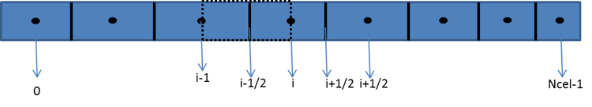
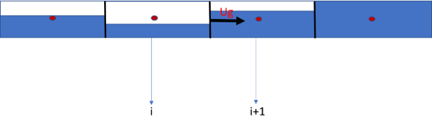
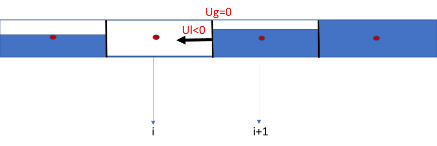

A useful physical interpretation of `Marlim3` numerical scheme is to view it through the lens of wave propagation. In a transient hyperbolic transport problem, the state computed at a given location and time depends only on a limited region of the previous solution: its domain of dependence. The CFL restriction expresses, in numerical form, the requirement that this physical domain of dependence remain compatible with the numerical stencil used to advance the solution. In practical terms, an explicit update is reliable only if the relevant wave information does not travel across more than about one control volume during a single time step. This idea is especially important in `Marlim3`, because different parts of the model are associated with different propagation speeds: holdup-related information is linked to slower waves, while pressure-related information is linked to much faster ones. The semi-implicit strategy follows directly from this separation.

## Staggered grid

A finite-volume discretization on a staggered grid will be adopted for the governing equations.

The solid-line cells are the control volumes in which the mass-conservation equations and the evolution equations for holdup and $\beta$ are solved. The dashed-line cell corresponds to the control volume used for the momentum equation. The energy equation is a special case: because it is written in non-conservative form, a standard finite-volume treatment is not the most natural approach, and an adapted finite-difference formulation is therefore employed. Referring again to the previous figure, variables such as holdup, $\beta$, pressure, temperature, mass-transfer rate, light-fraction volume, gas density, CO$_2$ fraction, slip-corrected gas--oil ratio, mass sources, enthalpies, and heat flux are stored at integer-index locations. By contrast, flux-related variables---mixture mass flow rate, liquid mass flow rate, gas mass flow rate, flow patterns, slip parameters, and superficial velocities---are evaluated at fractional-index locations, which in this discretization correspond to the control-volume faces where the mass balance is enforced, in accordance with the Reynolds transport theorem.

Throughout this text, the index $i$ denotes the spatial position and the index $k$ denotes the time level. In addition, an iterative procedure may be adopted to obtain a fully implicit time advancement. The numerical strategy considered here has two branches: a simpler and faster semi-implicit formulation, and a more complete but computationally more expensive iterative formulation. The iterative procedure is required to retain in the numerical model terms that are neglected in the simpler semi-implicit scheme. Naturally, this iterative procedure ultimately leads to a fully implicit approach. At first sight, this may appear advantageous because it removes time-step restrictions associated with the CFL criterion. In practice, however, multiphase numerical methods are subject to limitations that go beyond those usually discussed in standard numerical-methods textbooks. One of the most important limitations arises from transitions between multiphase and single-phase flow conditions. Such transitions behave as genuine model singularities, and the code must make specific decisions when they occur. Very large time steps may hinder a proper transition between multiphase and single-phase regimes. Therefore, even in implicit schemes that are formally free from CFL restrictions, large time increments may still be inadvisable in transient multiphase simulations. From this standpoint, a semi-implicit scheme is often the most appropriate choice.

## Holdup evolution equation

Consider the discretization of the holdup evolution equation:

$$\left[1 - (1-F_w)\frac{R_s \gamma_g \rho_{air}^{std}}{\rho_{lp}B_o}(1-\beta)\right]\frac{\partial(1-\alpha)}{\partial t} =- \frac{1}{A\rho_{lp}}\frac{\partial \dot{M}_p}{\partial x} - \frac{1}{A\rho_{lc}}\left[1-(1-F_w)\frac{R_s \gamma_g \rho_{air}^{std}}{\rho_{lp}B_o}\right]\frac{\partial \dot{M}_c}{\partial x}+ \frac{1}{A\rho_{lp}}\frac{\partial(1-\beta)(1-F_w)\frac{R_s \gamma_g \rho_{air}^{std}}{B_o}Q_l}{\partial x} + \left[1-(1-F_w)\frac{R_s \gamma_g \rho_{air}^{std}}{\rho_{lp}B_o}\right]\frac{\Gamma_{cp}}{A\rho_{lc}\Delta L} + \frac{\Gamma_{lp}}{A\rho_{lp}\Delta L}- \left[\frac{(1-\alpha)(1-\beta)}{\rho_{lp}}\frac{\partial \rho_{lp}}{\partial t} + \frac{(1-\alpha)\beta}{\rho_{lc}}\frac{\partial \rho_{lc}}{\partial t} - \frac{A(1-F_w)}{ A\rho_{lp}}\frac{R_s \gamma_g \rho_{air}^{std}}{B_o}(1-\alpha)\frac{\beta}{\rho_{lc}}\frac{\partial \rho_{lc}}{\partial t} - \frac{A(1-\alpha)(1-\beta)}{A\rho_{lp}}\frac{\partial(1-F_w)\frac{R_s \gamma_g \rho_{air}^{std}}{B_o}}{\partial t}\right] \label{eq:holdup_evolution_final}$$

If a semi-implicit scheme is adopted, the time-derivative terms appearing on the right-hand side of the equation, within the bracketed expression, are neglected:

$$\begin{equation}
\begin{aligned}
&\frac{\partial(1-\alpha)}{\partial t}
- (1 - F_w)\frac{R_s \gamma_g \rho_{\mathrm{ar}}^{\mathrm{std}}}{\rho_{\mathrm{lp}} B_o}
(1-\beta)\frac{\partial(1-\alpha)}{\partial t}
- (1 - F_w)\frac{R_s \gamma_g \rho_{\mathrm{ar}}^{\mathrm{std}}}{A\rho_{\mathrm{lp}} B_o}
\frac{1}{\rho_{\mathrm{lc}}}\frac{\partial \dot{M}_c}{\partial x} \\[6pt]
&- \frac{1}{A\rho_{\mathrm{lp}}}
\frac{\partial\!\left[(1-\beta)(1-F_w)\dfrac{R_s \gamma_g \rho_{\mathrm{ar}}^{\mathrm{std}}}{B_o} Q_l\right]}{\partial x}
+ (1 - F_w)\frac{R_s \gamma_g \rho_{\mathrm{ar}}^{\mathrm{std}}}{A\rho_{\mathrm{lp}} B_o}
\frac{\Gamma_{\mathrm{cp}}}{\rho_{\mathrm{lc}}\,\Delta L} = \\[6pt]
&\quad - \frac{1}{A\rho_{\mathrm{lp}}}\frac{\partial \dot{M}_p}{\partial x}
- \frac{1}{A\rho_{\mathrm{lc}}}\frac{\partial \dot{M}_c}{\partial x}
+ \frac{\Gamma_{\mathrm{cp}}}{A\rho_{\mathrm{lc}}\,\Delta L}
+ \frac{\Gamma_{\mathrm{lp}}}{A\rho_{\mathrm{lp}}\,\Delta L}
\end{aligned}
\label{eq:holdup_simp}
\end{equation}$$

In this form, \eqref{eq:holdup_simp} becomes a pure evolution equation for holdup, or equivalently for the void fraction. As will be shown, this is particularly convenient when transitions between multiphase and single-phase conditions occur. As already noted, most of the information governing changes in void fraction is carried by the slower wave families; in a drift-flux model, this corresponds to a wave propagating at the gas-phase velocity. Consequently, the CFL time-step restriction for this equation is of the order of $\Delta x/|u_g|$, which is far less restrictive than the condition associated with faster waves, such as those related to pressure propagation. In summary, for \eqref{eq:holdup_simp}, provided that the CFL condition $\Delta t < \Delta x/|u_g|$ is satisfied, a fully explicit discretization may be employed, which greatly simplifies the numerical treatment of this equation.

A brief discussion of the CFL criterion is warranted at this point. The aim here is not to present a mathematically rigorous derivation, but rather to provide a physical interpretation of this stability restriction. In the present context, one may think of each control volume as temporarily storing a locally constant state, so that the interfaces between neighboring cells behave like a sequence of local Riemann problems. The explicit update remains physically consistent only while the waves emitted from those interfaces still “belong” to the states from which they were generated. Once a wave has had time to cross too many cells, the assumption that the propagation speeds and transported information are still represented by the old-time data becomes poor. This is the practical meaning of the CFL restriction in `Marlim3`: it is not merely a formal numerical bound, but a direct expression of how far the relevant physical information may travel during one explicit step.

Considering the CFL restriction for the slowest wave family in the drift-flux model, $\Delta t < \Delta x/|u_g|$, \eqref{eq:holdup_simp} may be discretized explicitly as follows:

$$
\begin{equation}
\alpha_i^{k+1} = \alpha_i^k - \Delta t \,
\dfrac{
  \left\{
  \begin{array}{l}
  \displaystyle
  \left[
    (1-F_w)\frac{R_s \gamma_g \rho_{\mathrm{ar}}^{\mathrm{std}}}{A\rho_{\mathrm{lp}} B_o}
    \frac{1}{\rho_{\mathrm{lc}}}
    - \frac{1}{A\rho_{\mathrm{lc}}}
  \right]_i^k
  \frac{
    {}^{k}\!\dot{M}_c\big|_{i+\frac{1}{2}}
    - {}^{k}\!\dot{M}_c\big|_{i-\frac{1}{2}}
  }{\Delta x\big|_i}
  - \left.\frac{1}{A\rho_{\mathrm{lp}}}\right|_i^k
  \frac{
    {}^{k}\!\dot{M}_p\big|_{i+\frac{1}{2}}
    - {}^{k}\!\dot{M}_p\big|_{i-\frac{1}{2}}
  }{\Delta x\big|_i}
  + \\[12pt]
  \displaystyle
  \left.\frac{1}{A\rho_{\mathrm{lp}}}\right|_i^k
  \frac{
    \left.(1-\beta)(1-F_w)\dfrac{R_s \gamma_g \rho_{\mathrm{ar}}^{\mathrm{std}}}{B_o}
    Q_l\right|_{i+\frac{1}{2}}^{k}
    -
    \left.(1-\beta)(1-F_w)\dfrac{R_s \gamma_g \rho_{\mathrm{ar}}^{\mathrm{std}}}{B_o}
    Q_l\right|_{i-\frac{1}{2}}^{k}
  }{\Delta x\big|_i}
  + \\[12pt]
  \displaystyle
  \left[1-(1-F_w)\frac{R_s \gamma_g \rho_{\mathrm{ar}}^{\mathrm{std}}}{\rho_{\mathrm{lp}} B_o}\right]
  \left.\frac{\Gamma_{\mathrm{cp}}}{A\rho_{\mathrm{lc}}\,\Delta x\big|_i}\right|_i^k
  +
  \left.\frac{\Gamma_{\mathrm{lp}}}{A\rho_{\mathrm{lp}}\,\Delta x\big|_i}\right|_i^k
  \end{array}
  \right\}
}{
  \displaystyle
  \left.\left[
    1-(1-F_w)\frac{R_s \gamma_g \rho_{\mathrm{ar}}^{\mathrm{std}}}{\rho_{\mathrm{lp}} B_o}
    (1-\beta)
  \right]\right|_i^k
}
\label{eq:holdup_ev_disc1}
\end{equation}
$$

A key advantage of this void-fraction evolution equation is that any violation of its admissible bounds — which must remain between zero and one — is detected immediately. If the updated void fraction falls below zero or exceeds one, the time step can be corrected before the remaining variables are updated, thereby avoiding unnecessary performance penalties. To obtain this practical benefit, however, it was necessary to omit certain terms from the holdup evolution equation \eqref{eq:holdup_evolution_final}, as discussed previously. If all terms of the mass-conservation equations were to be retained within a semi-implicit formulation, the evolution equation would no longer be written directly for the void fraction, but rather for the two composite variables $\rho_\mathrm{l}(1-\alpha)$ and $\rho_\mathrm{g}\alpha$; see Liles & Reed (1978). In that case, recovering the void fraction explicitly from these variables would require the pressure and temperature fields to have already been updated at the new time level. Consequently, any violation of the void-fraction bounds would only be detected after all variables had been advanced, and any correction of the time step could only be performed once the entire time step had been completed -- a less practical approach than that proposed in \eqref{eq:holdup_ev_disc1}.

If all terms in \eqref{eq:holdup_evolution_final} are to be retained, an iterative scheme must be employed, at the cost of increased computational effort. In this case, the procedure would begin with the explicit solution of \eqref{eq:holdup_ev_disc1}, followed by updates of pressure and temperature, which would then allow evaluation of the time-derivative terms previously neglected. The resulting discretization would be analogous to \eqref{eq:holdup_ev_disc1}, but augmented by those additional contributions, rendering the method fully implicit. Tests carried out with `Marlim3` indicate that the neglected terms have only a minor influence on the class of problems of interest. Therefore, only the simplified semi-implicit formulation will be considered henceforth.

## $\beta$ evolution equation

We now consider the evolution equation for the complementary-fluid fraction $\beta$:

$$
\frac{\partial \beta}{\partial t} = \frac{\Gamma_{cp}}{A(1-\alpha)\rho_{lc}\Delta L} - \frac{\beta}{(1-\alpha)}\frac{\partial(1-\alpha)}{\partial t} - \frac{1}{A(1-\alpha)\rho_{lc}}\frac{\partial \dot{M}_c}{\partial x} - \left(\frac{\beta}{\rho_{lc}}\frac{\partial \rho_{lc}}{\partial t}\right)
\label{eq:beta_evolution_2}
$$

The discretization of \eqref{eq:beta_evolution_2} is given by:

$$
\begin{equation}
\beta_i^k +
\left\{
  \left.\frac{\beta}{(1-\alpha)}\right|_i^k
  \frac{\alpha_i^{k+1} - \alpha_i^k}{\Delta t}
  - \left.\frac{1}{A(1-\alpha)\rho_{\mathrm{lc}}}\right|_i^k
  \frac{
    \dot{M}_c\big|_{i+\frac{1}{2}}^{k}
    - \dot{M}_c\big|_{i-\frac{1}{2}}^{k}
  }{\Delta x_i}
  + \left.\frac{\Gamma_{\mathrm{cp}}}{A(1-\alpha)\rho_{\mathrm{lc}}\,\Delta x_i}\right|_i^k
\right\}
\label{eq:beta_disc}
\end{equation}
$$

Note that, in order to advance $\beta$ in \eqref{eq:beta_disc}, the void-fraction profile at time level $k$ must already be available. Consequently, \eqref{eq:beta_disc} is solved only after \eqref{eq:holdup_ev_disc1} has been resolved. As with the void fraction, $\beta$ is bounded between 0 and 1, and time-step corrections may likewise be required during its update whenever those bounds are violated.

## Pressure-velocity coupling

Once the profiles of $\alpha$ and $\beta$ have been obtained, the next step is to solve the pressure–velocity coupling problem. As discussed previously, pressure is closely associated with the fastest wave families, which are in turn related to fluid compressibility. These fast waves impose a more restrictive CFL condition; therefore, if time increments larger than those dictated by compressibility are to be used, the equations governing pressure–velocity coupling must be treated implicitly. In other words, the implicit part of the algorithm is not introduced merely as an algebraic convenience, but because it decouples the time step from the fastest pressure-carrying waves while keeping the slower holdup transport explicit. The equations used to determine the pressure profile and the mixture mass flow rate are:

$$\frac{\alpha}{\rho_g}\left.\frac{\partial \rho_g}{\partial p}\right|_T \frac{\partial p}{\partial t} + \frac{1}{A\rho_g}\frac{\partial (1-T_1)\dot{M}_m - T_2}{\partial x} + \frac{1}{A\rho_{lp}}\frac{\partial \rho_{lp}(1-\beta)\frac{T_1\dot{M}_m+T_2}{\rho_l}}{\partial x} + \frac{1}{A\rho_{lc}}\frac{\partial \rho_{lc}\beta\frac{T_1\dot{M}_m+T_2}{\rho_l}}{\partial x}+ \frac{1}{A}\left(\frac{1}{\rho_g} - \frac{1}{\rho_{lp}}\right)\frac{\partial(1-\beta)(1-F_w)\frac{R_s \gamma_g \rho_{ar}^{std}}{B_o}\frac{T_1\dot{M}_m+T_2}{\rho_l}}{\partial x} =\frac{\Gamma_{lp}}{A\rho_{lp}\Delta L} + \frac{\Gamma_{cp}}{A\rho_{lc}\Delta L} + \frac{\Gamma_g}{A\rho_g\Delta L} - \frac{1}{A}\left(\frac{1}{\rho_g} - \frac{1}{\rho_{lp}}\right)\left[A(1-F_w)\frac{R_s \gamma_g \rho_{ar}^{std}}{B_o}\frac{\partial(1-\alpha)(1-\beta)}{\partial t}\right]-\left[\frac{(1-\alpha)(1-\beta)}{\rho_{lp}}\frac{\partial \rho_{lp}}{\partial t} + \frac{(1-\alpha)\beta}{\rho_{lc}}\frac{\partial \rho_{lc}}{\partial t} + \frac{\alpha}{\rho_g}\left.\frac{\partial \rho_g}{\partial T}\right|_p\frac{\partial T}{\partial t} + \frac{1}{A}\left(\frac{1}{\rho_g} - \frac{1}{\rho_{lp}}\right)A(1-\alpha)(1-\beta)\frac{\partial(1-F_w)\frac{R_s \gamma_g \rho_{ar}^{std}}{B_o}}{\partial t}\right] \label{eq:p_m_acop}
$$

$$
\frac{\partial \dot{M}_g}{\partial t} + A_t \frac{\partial p}{\partial x} = f_m \frac{\rho_m j^2}{2} S_w + \rho_m g A_t \sin(\theta)
\label{eq:simplified_momentum}
$$

The discretization of these equations is presented below.

For the equation \eqref{eq:p_m_acop}:

$$
\begin{equation}
\begin{aligned}
&\frac{1}{\rho_g}\frac{\partial \rho_g}{\partial p}\bigg|_T \bigg|_{i-1}^{k}
  \frac{\alpha_{i-1}^{k+1}}{\Delta t}\, p_{i-1}^{k+1}
+ CT_1\big|_{i-\frac{1}{2}}^{k} \dot{M}_m\big|_{i-\frac{1}{2}}^{k+1}
- CT_1\big|_{i-\frac{3}{2}}^{k} \dot{M}_m\big|_{i-\frac{3}{2}}^{k+1}
\\[6pt]
&+\frac{1}{A}\!\left(\frac{1}{\rho_g}-\frac{1}{\rho_{\mathrm{lp}}}\right)_{i-1}^{k}
  \frac{1}{\Delta x_{i-1}}
  \left[
    \left(1-\beta_{i-\frac{1}{2}}^{k+1}\right)(1-F_w)
    \frac{\partial\frac{R_s}{B_o}}{\partial p}
    \frac{\gamma_g \rho_{\mathrm{ar}}^{\mathrm{std}} T_1}{\rho_l}
    \dot{M}_m\bigg|_{i-\frac{1}{2}}^{k}
    p\big|_{i-\frac{1}{2}}^{k+1}
  \right.\\
&\quad\quad\quad\quad\quad\quad\quad\quad\quad\quad\quad
  \left.
    -\left(1-\beta_{i-\frac{3}{2}}^{k+1}\right)(1-F_w)
    \frac{\partial\frac{R_s}{B_o}}{\partial p}
    \frac{\gamma_g \rho_{\mathrm{ar}}^{\mathrm{std}} T_1}{\rho_l}
    \dot{M}_m\bigg|_{i-\frac{3}{2}}^{k}
    p\big|_{i-\frac{3}{2}}^{k+1}
  \right]
\\[10pt]
&= \frac{1}{\rho_g}\frac{\partial \rho_g}{\partial p}\bigg|_T \bigg|_{i-1}^{k}
  \frac{\alpha_{i-1}^{k+1}}{\Delta t}\, p_{i-1}^{k}
- CT_2\big|_{i-\frac{1}{2}}^{k}
+ CT_2\big|_{i-\frac{3}{2}}^{k}
+ \left(
    \frac{\Gamma_{\mathrm{lp}}}{A\rho_{\mathrm{lp}}\Delta L}
    +\frac{\Gamma_{\mathrm{cp}}}{A\rho_{\mathrm{lc}}\Delta L}
    +\frac{\Gamma_g}{A\rho_g \Delta L}
  \right)_{i-1}^{k}
\\[6pt]
&-\left[\frac{1}{A}\!\left(\frac{1}{\rho_g}-\frac{1}{\rho_{\mathrm{lp}}}\right)
  A(1-F_w)\frac{R_s \gamma_g \rho_{\mathrm{ar}}^{\mathrm{std}}}{B_o}\right]_{i-1}^{k}
  \left[
    \frac{\left(1-\alpha_{i-1}^{k+1}\right)\!\left(1-\beta_{i-1}^{k+1}\right)
         -\left(1-\alpha_{i-1}^{k}\right)\!\left(1-\beta_{i-1}^{k}\right)}
         {\Delta t}
  \right]
\\[6pt]
&+\frac{1}{A}\!\left(\frac{1}{\rho_g}-\frac{1}{\rho_{\mathrm{lp}}}\right)_{i-1}^{k}
  \frac{1}{\Delta x_{i-1}}
  \left[
    \left(1-\beta_{i-\frac{1}{2}}^{k+1}\right)(1-F_w)
    \frac{\partial\frac{R_s}{B_o}}{\partial p}
    \frac{\gamma_g \rho_{\mathrm{ar}}^{\mathrm{std}} T_1}{\rho_l}
    \dot{M}_m\bigg|_{i-\frac{1}{2}}^{k}
    p\big|_{i-\frac{1}{2}}^{k}
  \right.\\
&\quad\quad\quad\quad\quad\quad\quad\quad\quad\quad\quad
  \left.
    -\left(1-\beta_{i-\frac{3}{2}}^{k+1}\right)(1-F_w)
    \frac{\partial\frac{R_s}{B_o}}{\partial p}
    \frac{\gamma_g \rho_{\mathrm{ar}}^{\mathrm{std}} T_1}{\rho_l}
    \dot{M}_m\bigg|_{i-\frac{3}{2}}^{k}
    p\big|_{i-\frac{3}{2}}^{k}
  \right]
\end{aligned}
\label{eq:p_m_acop_disc}
\end{equation}
$$

Where:

$$\begin{equation}
CT_1\big|_{i-\frac{1}{2}}^{k} = \frac{1}{A\Delta x_{i-1}}
\left[
\begin{array}{l}
\displaystyle
\left.\frac{1}{\rho_g}\right|_{i-1}^{k}
\!\left(1-T_1\right)_{i-\frac{1}{2}}^{k}
+\left.\frac{1}{\rho_{\mathrm{lp}}}\right|_{i-1}^{k}
\!\left(1-\beta_{i-\frac{1}{2}}^{k+1}\right)
\left.\frac{\rho_{\mathrm{lp}}\,T_1}{\rho_l}\right|_{i-\frac{1}{2}}^{k}
+\\[8pt]
\displaystyle
\left.\frac{1}{\rho_{\mathrm{lc}}}\right|_{i-1}^{k}
\beta_{i-\frac{1}{2}}^{k+1}
\left.\frac{\rho_{\mathrm{lc}}\,T_1}{\rho_l}\right|_{i-\frac{1}{2}}^{k}
+\\[8pt]
\displaystyle
\left(\frac{1}{\rho_g}-\frac{1}{\rho_{\mathrm{lp}}}\right)_{i-1}^{k}
\!\left(1-\beta_{i-\frac{1}{2}}^{k+1}\right)(1-F_w)
\left.\frac{R_s\gamma_g\rho_{\mathrm{ar}}^{\mathrm{std}}\,T_1}{B_o\,\rho_l}\right|_{i-\frac{1}{2}}^{k}
\end{array}
\right]
\end{equation}$$

$$\begin{equation}
CT_2\big|_{i-\frac{1}{2}}^{k} = \frac{1}{A\Delta x_{i-1}}
\left[
\begin{array}{l}
\displaystyle
-\left.\frac{1}{\rho_g}\right|_{i-1}^{k}
\!\left(T_2\right)_{i-\frac{1}{2}}^{k}
+\left.\frac{1}{\rho_{\mathrm{lp}}}\right|_{i-1}^{k}
\!\left(1-\beta_{i-\frac{1}{2}}^{k+1}\right)
\left.\frac{\rho_{\mathrm{lp}}\,T_2}{\rho_l}\right|_{i-\frac{1}{2}}^{k}
+\\[8pt]
\displaystyle
\left.\frac{1}{\rho_{\mathrm{lc}}}\right|_{i-1}^{k}
\beta_{i-\frac{1}{2}}^{k+1}
\left.\frac{\rho_{\mathrm{lc}}\,T_2}{\rho_l}\right|_{i-\frac{1}{2}}^{k}
+\\[8pt]
\displaystyle
\left(\frac{1}{\rho_g}-\frac{1}{\rho_{\mathrm{lp}}}\right)_{i-1}^{k}
\!\left(1-\beta_{i-\frac{1}{2}}^{k+1}\right)(1-F_w)
\left.\frac{R_s\gamma_g\rho_{\mathrm{ar}}^{\mathrm{std}}\,T_2}{B_o\,\rho_l}\right|_{i-\frac{1}{2}}^{k}
\end{array}
\right]
\end{equation}$$

$$\begin{equation}
CT_1\big|_{i-\frac{3}{2}}^{k} = \frac{1}{A\Delta x_{i-1}}
\left[
\begin{array}{l}
\displaystyle
\left.\frac{1}{\rho_g}\right|_{i-1}^{k}
\!\left(1-T_1\right)_{i-\frac{3}{2}}^{k}
+\left.\frac{1}{\rho_{\mathrm{lp}}}\right|_{i-1}^{k}
\!\left(1-\beta_{i-\frac{3}{2}}^{k+1}\right)
\left.\frac{\rho_{\mathrm{lp}}\,T_1}{\rho_l}\right|_{i-\frac{3}{2}}^{k}
+\\[8pt]
\displaystyle
\left.\frac{1}{\rho_{\mathrm{lc}}}\right|_{i-1}^{k}
\beta_{i-\frac{3}{2}}^{k+1}
\left.\frac{\rho_{\mathrm{lc}}\,T_1}{\rho_l}\right|_{i-\frac{3}{2}}^{k}
+\\[8pt]
\displaystyle
\left(\frac{1}{\rho_g}-\frac{1}{\rho_{\mathrm{lp}}}\right)_{i-1}^{k}
\!\left(1-\beta_{i-\frac{3}{2}}^{k+1}\right)(1-F_w)
\left.\frac{R_s\gamma_g\rho_{\mathrm{ar}}^{\mathrm{std}}\,T_1}{B_o\,\rho_l}\right|_{i-\frac{3}{2}}^{k}
\end{array}
\right]
\end{equation}$$

$$\begin{equation}
CT_2\big|_{i-\frac{3}{2}}^{k} = \frac{1}{A\Delta x_{i-1}}
\left[
\begin{array}{l}
\displaystyle
-\left.\frac{1}{\rho_g}\right|_{i-1}^{k}
\!\left(T_2\right)_{i-\frac{3}{2}}^{k}
+\left.\frac{1}{\rho_{\mathrm{lp}}}\right|_{i-1}^{k}
\!\left(1-\beta_{i-\frac{3}{2}}^{k+1}\right)
\left.\frac{\rho_{\mathrm{lp}}\,T_2}{\rho_l}\right|_{i-\frac{3}{2}}^{k}
+\\[8pt]
\displaystyle
\left.\frac{1}{\rho_{\mathrm{lc}}}\right|_{i-1}^{k}
\beta_{i-\frac{3}{2}}^{k+1}
\left.\frac{\rho_{\mathrm{lc}}\,T_2}{\rho_l}\right|_{i-\frac{3}{2}}^{k}
+\\[8pt]
\displaystyle
\left(\frac{1}{\rho_g}-\frac{1}{\rho_{\mathrm{lp}}}\right)_{i-1}^{k}
\!\left(1-\beta_{i-\frac{3}{2}}^{k+1}\right)(1-F_w)
\left.\frac{R_s\gamma_g\rho_{\mathrm{ar}}^{\mathrm{std}}\,T_2}{B_o\,\rho_l}\right|_{i-\frac{3}{2}}^{k}
\end{array}
\right]
\end{equation}$$

Several aspects of this algebraization deserve attention. The spatial derivatives of the mixture mass flow rate are treated implicitly with respect to that variable; however, the pressure-dependent terms appearing in those derivatives are handled explicitly — for instance, the densities within these derivatives are evaluated at time level $k$ rather than $k+1$. There is one exception: the derivative $\frac{\partial\left(1-\beta\right)\left(1-F_w\right)\frac{R_s\gamma_g\rho_{\mathrm{air}}^{\mathrm{std}}}{B_o}\frac{T_1{\dot{M}}m+T_2}{\rho_l}}{\partial x}$ appearing in \eqref{eq:p_m_acop}, which originates from the interphase mass transfer terms. It was observed that the pressure–velocity coupling gains in stability when partial implicitization in pressure is applied to this derivative, specifically through the ratio $\frac{R_s}{B_o}$. To this end, the following first-order Taylor expansion is employed: $\left.\frac{R_s}{B_o}\right|{i-\frac{1}{2}}^{k+1}=\left.\frac{R_s}{B_o}\right|{i-\frac{1}{2}}^k+\left.\frac{\partial\frac{R_s}{B_o}}{\partial p}\right|{i-\frac{1}{2}}^k\left(p_{i-\frac{1}{2}}^{k+1}-p_{i-\frac{1}{2}}^k\right)$. While this improves coupling stability, it introduces an additional difficulty: the pressure solved in the coupling procedure is defined at cell centers, whereas the expansion introduces an implicitly treated boundary pressure. An expression for this boundary pressure in terms of the cell-center pressure is therefore required. A straightforward approach is to estimate the boundary pressure from the cell-center values using the local hydrostatic and frictional pressure gradient terms:

$$\begin{equation}
\begin{aligned}
p_{i-\frac{1}{2}}^{k+1} &= 0.5\!\left(p_i^{k+1} + p_{i-1}^{k+1}\right)
+ 0.5\!\left(
    \rho_m\big|_i^k\, g\,\frac{\Delta x_i}{2}\,\mathrm{sen}(\theta_i)
  - \rho_m\big|_{i-1}^k\, g\,\frac{\Delta x_{i-1}}{2}\,\mathrm{sen}(\theta_{i-1})
  \right) \\[8pt]
&+ 0.5\!\left(
    \rho_m\big|_{i-1}^k f_{i-1}^k \frac{S_{i-1}}{A_{i-1}}\frac{\Delta x_{i-1}}{2}
  - \rho_m\big|_i^k f_i^k \frac{S_i}{A_i}\frac{\Delta x_i}{2}
  \right)
  \frac{
    \left|\, j_{i-\frac{1}{2}}^k \,\right| j_{i-\frac{1}{2}}^k
  }{2}
= \frac{p_i^{k+1}}{2} + \frac{p_{i-1}^{k+1}}{2}
+ \left.\mathit{correction}\right|_{i-\frac{1}{2}}^{k}
\end{aligned}
\label{eq:estim_press}
\end{equation}$$

Equation \eqref{eq:estim_press} provides one approach to this problem, but it may prove problematic in certain scenarios, particularly in slow segregation processes. Note that the relationship between the boundary pressure and the cell-center pressure still depends on quantities evaluated at time level $k$, which introduces a degree of explicitness into this coupling. In slow segregation regimes, this can give rise to numerical instabilities; in such cases, the recommended approach is simply to discard this correction term. Accordingly, `Marlim3` offers the option to enable or disable this contribution.

With this:

$$
\begin{equation}
\begin{aligned}
&\frac{1}{\rho_g}\frac{\partial \rho_g}{\partial p}\bigg|_T \bigg|_{i-1}^{k}
  \frac{\alpha_{i-1}^{k+1}}{\Delta t}\, p_{i-1}^{k+1} \\[6pt]
&+\frac{1}{2}\frac{1}{A}\!\left(\frac{1}{\rho_g}-\frac{1}{\rho_{\mathrm{lp}}}\right)_{i-1}^{k}
  \frac{1}{\Delta x_{i-1}}
  \left[
  \begin{array}{l}
  \displaystyle
    \left(1-\beta_{i-\frac{1}{2}}^{k+1}\right)(1-F_w)
    \frac{\partial\frac{R_s}{B_o}}{\partial p}
    \frac{\gamma_g \rho_{\mathrm{ar}}^{\mathrm{std}}\,T_1}{\rho_l}
    \dot{M}_m\bigg|_{i-\frac{1}{2}}^{k}
    \!\left(p\big|_i^{k+1}+p\big|_{i-1}^{k+1}\right) \\[10pt]
  \displaystyle
    -\left(1-\beta_{i-\frac{3}{2}}^{k+1}\right)(1-F_w)
    \frac{\partial\frac{R_s}{B_o}}{\partial p}
    \frac{\gamma_g \rho_{\mathrm{ar}}^{\mathrm{std}}\,T_1}{\rho_l}
    \dot{M}_m\bigg|_{i-\frac{3}{2}}^{k}
    \!\left(p\big|_{i-1}^{k+1}+p\big|_{i-2}^{k+1}\right)
  \end{array}
  \right] \\[6pt]
&+ CT_1\big|_{i-\frac{1}{2}}^{k}\,\dot{M}_m\big|_{i-\frac{1}{2}}^{k+1}
  - CT_1\big|_{i-\frac{3}{2}}^{k}\,\dot{M}_m\big|_{i-\frac{3}{2}}^{k+1} \\[10pt]
&= \frac{1}{\rho_g}\frac{\partial \rho_g}{\partial p}\bigg|_T \bigg|_{i-1}^{k}
  \frac{\alpha_{i-1}^{k+1}}{\Delta t}\, p_{i-1}^{k}
  - CT_2\big|_{i-\frac{1}{2}}^{k}
  + CT_2\big|_{i-\frac{3}{2}}^{k}
  + \left(
      \frac{\Gamma_{\mathrm{lp}}}{A\rho_{\mathrm{lp}}\Delta L}
      +\frac{\Gamma_{\mathrm{cp}}}{A\rho_{\mathrm{lc}}\Delta L}
      +\frac{\Gamma_g}{A\rho_g\Delta L}
    \right)_{i-1}^{k} \\[6pt]
&- \left[\frac{1}{A}\!\left(\frac{1}{\rho_g}-\frac{1}{\rho_{\mathrm{lp}}}\right)
    A(1-F_w)\frac{R_s\gamma_g\rho_{\mathrm{ar}}^{\mathrm{std}}}{B_o}
  \right]_{i-1}^{k}
  \left[
    \frac{\left(1-\alpha_{i-1}^{k+1}\right)\!\left(1-\beta_{i-1}^{k+1}\right)
         -\left(1-\alpha_{i-1}^{k}\right)\!\left(1-\beta_{i-1}^{k}\right)}
         {\Delta t}
  \right] \\[6pt]
&+\frac{1}{A}\!\left(\frac{1}{\rho_g}-\frac{1}{\rho_{\mathrm{lp}}}\right)_{i-1}^{k}
  \frac{1}{\Delta x_{i-1}}
  \left[
  \begin{array}{l}
  \displaystyle
    \left(1-\beta_{i-\frac{1}{2}}^{k+1}\right)(1-F_w)
    \frac{\partial\frac{R_s}{B_o}}{\partial p}
    \frac{\gamma_g \rho_{\mathrm{ar}}^{\mathrm{std}}\,T_1}{\rho_l}
    \dot{M}_m\bigg|_{i-\frac{1}{2}}^{k}
    \!\left(p\big|_{i-\frac{1}{2}}^{k}
    -\left.\mathit{correction}\right|_{i-\frac{1}{2}}^{k}\right) \\[10pt]
  \displaystyle
    -\left(1-\beta_{i-\frac{3}{2}}^{k+1}\right)(1-F_w)
    \frac{\partial\frac{R_s}{B_o}}{\partial p}
    \frac{\gamma_g \rho_{\mathrm{ar}}^{\mathrm{std}}\,T_1}{\rho_l}
    \dot{M}_m\bigg|_{i-\frac{3}{2}}^{k}
    \!\left(p\big|_{i-\frac{3}{2}}^{k}
    -\left.\mathit{correction}\right|_{i-\frac{3}{2}}^{k}\right)
  \end{array}
  \right]
\end{aligned}
\label{eq:p_m_acop_disc2}
\end{equation}
$$

A remark is warranted regarding the source terms in \eqref{eq:p_m_acop_disc2}: all source terms are evaluated at time level $k$ and are therefore treated explicitly. However, this approach is not advisable for mass sources of the IPR type, in which the mass source becomes dependent on the local cell pressure. For high productivity indices, typical of pre-salt wells, treating this dependence explicitly may lead to numerical instabilities. Consequently, IPR-type mass sources in \eqref{eq:p_m_acop_disc2} are handled through a Taylor expansion, introducing a controlled degree of implicitness:

$$
\mathrm{\Gamma}=\texttt{IPR}\left(p\right)=\texttt{IPR}\left(p^k\right)+\left.\frac{\partial \texttt{IPR}\left(p\right)}{\partial p}\right|^k\left(p^{k+1}-p^k\right)
$$

It should be noted that boundary pressures are obtained from cell-centered variables using either pressure loss corrections or simple averaging relations. This is a reasonable approach for pressure, since the implicit treatment of this quantity targets the solution of an elliptic problem — the time steps are not intended to resolve the fast waves associated with pressure propagation. For other boundary quantities, however, such an approach is inadequate and may compromise the simulation. Consider, for instance, the terms $T_1$ and $T_2$, which are boundary quantities dependent on the void fraction. Here, particular care is required: the time advancement is designed to capture the wave family that effectively transports the void fraction, and the corresponding evolution equation is solved explicitly. It is therefore necessary to examine how this wave family propagates. Fortunately, this is straightforward — as previously stated, the relevant wave family travels at the gas velocity. To determine which value of the void fraction to assign at a given boundary, it suffices to inspect the direction of the gas velocity. For example, as illustrated in the figure below, the void fraction at the boundary $i+1/2$ must be taken equal to that of volume $i$, since this is the direction in which the quantity is being transported.

In the same way, to determine the boundary temperature, the velocity of advection of temperature is used: $\frac{\rho_g\alpha u_gc_{pg}+\rho_l\left(1-\alpha\right)u_lc_{pl}}{\rho_g\alpha c_{vg}^\prime+\rho_l\left(1-\alpha\right)c_{vl}}$.

For the momentum equation, the control volume is that represented by the dashed lines in the discretization shown at the beginning of this section. The discretized equation is given below:

$$\begin{equation}
\begin{aligned}
&\frac{
  \left(1-T_1\big|_{i+\frac{1}{2}}^{k}\right)\dot{M}_m\big|_{i+\frac{1}{2}}^{k+1}
  - T_2\big|_{i+\frac{1}{2}}^{k}\,\dot{M}_g\big|_{i+\frac{1}{2}}^{k}
}{\Delta t}
+ A\,\frac{p_{i+1}^{k+1}-p_i^{k+1}}{\Delta x}
= \frac{\Delta x_i}{\Delta x_i + \Delta x_{i+1}}
\left\{
  f_{m_i}^{\,k}\frac{\rho_m\big|_i}{2}\frac{S_w\big|_i}{A^2\big|_i}
  \left|\frac{\dot{M}_g\big|_{i+\frac{1}{2}}^{k}}{\rho_g\big|_i^k}\right|
\right. \\[8pt]
&+\frac{\dot{M}_l\big|_{i+\frac{1}{2}}^{k}}{\rho_l\big|_i^k}
  \left[
    \frac{
      \left(1-T_1\big|_{i+\frac{1}{2}}^{k}\right)\dot{M}_m\big|_{i+\frac{1}{2}}^{k+1}
      - T_2\big|_{i+\frac{1}{2}}^{k}\,\dot{M}_g\big|_{i+\frac{1}{2}}^{k}
    }{\rho_g\big|_i^k}
    +\frac{
      T_1\big|_{i+\frac{1}{2}}^{k}\,\dot{M}_m\big|_{i+\frac{1}{2}}^{k+1}
      + T_2\big|_{i+\frac{1}{2}}^{k}
    }{\rho_l\big|_i^k}
  \right]
  + \rho_m\big|_i\, g\, A\sin(\theta_i)
\left.\vphantom{\frac{1}{2}}\right\} \\[8pt]
&+ \frac{\Delta x_{i+1}}{\Delta x_i + \Delta x_{i+1}}
\left\{
  f_{m_{i+1}}^{\,k}\frac{\rho_m\big|_{i+1}}{2}\frac{S_w\big|_{i+1}}{A^2\big|_{i+1}}
  \left|\frac{\dot{M}_g\big|_{i+\frac{1}{2}}^{k}}{\rho_g\big|_{i+1}^k}\right|
  +\frac{\dot{M}_l\big|_{i+\frac{1}{2}}^{k}}{\rho_l\big|_{i+1}^k}
  \left[
    \frac{
      \left(1-T_1\big|_{i+\frac{1}{2}}^{k}\right)\dot{M}_m\big|_{i+\frac{1}{2}}^{k+1}
      - T_2\big|_{i+\frac{1}{2}}^{k}\,\dot{M}_g\big|_{i+\frac{1}{2}}^{k}
    }{\rho_g\big|_{i+1}^k}
  \right.
\right. \\[8pt]
&\quad\quad\quad\quad\quad\quad\quad\quad
  \left.\left.
    +\frac{
      T_1\big|_{i+\frac{1}{2}}^{k}\,\dot{M}_m\big|_{i+\frac{1}{2}}^{k+1}
      + T_2\big|_{i+\frac{1}{2}}^{k}
    }{\rho_l\big|_{i+1}^k}
  \right]
  + \rho_m\big|_{i+1}\, g\, A\sin(\theta_{i+1})
\right\}
\end{aligned}
\label{eq:momentum_disc}
\end{equation}$$

Where:

$$\left.\rho_m\right|_i=\left(1-\alpha_i^{k+1}\right)\left.\rho_l\right|_i^k+\alpha_i^{k+1}\left.\rho_g\right|_i^k$$

$$\left.\rho_m\right|_{i+1}=\left(1-\alpha_{i+1}^{k+1}\right)\left.\rho_l\right|_{i+1}^k+\alpha_{i+1}^{k+1}\left.\rho_g\right|_{i+1}^k$$		

A remark regarding the discretized momentum equation \eqref{eq:momentum_disc}: it was necessary to treat part of the frictional loss term implicitly. This is because friction is relevant on the time scale of the phenomena of interest; on this scale, the dynamic terms may be negligible and the pressure profile may exhibit behavior characteristic of an elliptic problem, in which frictional loss terms play a dominant role. Accordingly, formulating the pressure–velocity coupling without some degree of implicitness in the friction term may be detrimental to the simulation.

Considering:

$$\begin{equation}
CM_g\big|_i = \frac{1}{\rho_g\big|_i^k}
\frac{\Delta x_i}{\Delta x_i + \Delta x_{i+1}}
f_{m_i}^{\,k}
\frac{\rho_m\big|_i}{2}
\frac{S_w\big|_i}{A^2\big|_i}
\left|
  \frac{\dot{M}_g\big|_{i+\frac{1}{2}}^{k}}{\rho_g\big|_i^k}
  + \frac{\dot{M}_l\big|_{i+\frac{1}{2}}^{k}}{\rho_l\big|_i^k}
\right|
\end{equation}
$$

$$\begin{equation}
CM_l\big|_i = \frac{1}{\rho_l\big|_i^k}
\frac{\Delta x_i}{\Delta x_i + \Delta x_{i+1}}
f_{m_i}^{\,k}
\frac{\rho_m\big|_i}{2}
\frac{S_w\big|_i}{A^2\big|_i}
\left|
  \frac{\dot{M}_g\big|_{i+\frac{1}{2}}^{k}}{\rho_g\big|_i^k}
  + \frac{\dot{M}_l\big|_{i+\frac{1}{2}}^{k}}{\rho_l\big|_i^k}
\right|
\end{equation}$$

$$\begin{equation}
CM_g\big|_{i+1} = \frac{1}{\rho_g\big|_{i+1}^k}
\frac{\Delta x_{i+1}}{\Delta x_i + \Delta x_{i+1}}
f_{m_{i+1}}^{\,k}
\frac{\rho_m\big|_{i+1}}{2}
\frac{S_w\big|_{i+1}}{A^2\big|_{i+1}}
\left|
  \frac{\dot{M}_g\big|_{i+\frac{1}{2}}^{k}}{\rho_g\big|_{i+1}^k}
  + \frac{\dot{M}_l\big|_{i+\frac{1}{2}}^{k}}{\rho_l\big|_{i+1}^k}
\right|
\end{equation}$$

$$\begin{equation}
CM_l\big|_{i+1} = \frac{1}{\rho_l\big|_{i+1}^k}
\frac{\Delta x_{i+1}}{\Delta x_i + \Delta x_{i+1}}
f_{m_{i+1}}^{\,k}
\frac{\rho_m\big|_{i+1}}{2}
\frac{S_w\big|_{i+1}}{A^2\big|_{i+1}}
\left|
  \frac{\dot{M}_g\big|_{i+\frac{1}{2}}^{k}}{\rho_g\big|_{i+1}^k}
  + \frac{\dot{M}_l\big|_{i+\frac{1}{2}}^{k}}{\rho_l\big|_{i+1}^k}
\right|
\end{equation}$$

The equation \eqref{eq:momentum_disc} can be reorganized as follows:

$$\begin{equation}
\begin{aligned}
&\left\{
  \left[
    \frac{1}{\Delta t} - CM_g\big|_i - CM_g\big|_{i+1}
  \right]
  \left(1 - T_1\big|_{i+\frac{1}{2}}^{k}\right)
  - \left(CM_l\big|_i + CM_l\big|_{i+1}\right)
  T_1\big|_{i+\frac{1}{2}}^{k}
\right\}
\dot{M}_m\big|_{i+\frac{1}{2}}^{k+1}
+ \frac{A}{\Delta x}\,p_{i+1}^{k+1}
- \frac{A}{\Delta x}\,p_i^{k+1} = \\[8pt]
&\left(
  \frac{1}{\Delta t}
  - CM_g\big|_i
  + CM_l\big|_i
  - CM_g\big|_{i+1}
  + CM_l\big|_{i+1}
\right)
T_2\big|_{i+\frac{1}{2}}^{k}
+ \frac{\dot{M}_g\big|_{i+\frac{1}{2}}^{k}}{\Delta t}
+ \frac{\Delta x_i}{\Delta x_i + \Delta x_{i+1}}\,\rho_m\big|_i\, g\, A\sin(\theta_i) \\[8pt]
&+ \frac{\Delta x_{i+1}}{\Delta x_i + \Delta x_{i+1}}\,\rho_m\big|_{i+1}\, g\, A\sin(\theta_{i+1})
\end{aligned}
\end{equation}
$$

With this, a pair of discretized equations is obtained that maps the discretized domain and establishes the pressure–velocity coupling. The two control volumes employed are: volume $i-1$ for mixture mass conservation, and volume $i-1/2$ (the dashed volume) for the momentum equation. A noteworthy aspect of this discretization is that these two volumes are not adjacent — they are separated by one volume. Nevertheless, this is the most appropriate arrangement for setting up the coupling, as it ensures that the diagonal entries of the global matrix in which the problem is solved are not susceptible to cancellation during potential transitions from multiphase to single-phase flow. This will become clearer when the structure of the global matrix is discussed. For now, it suffices to note that this pair of equations forms a local matrix, subsequently assembled into the global matrix. This local matrix encodes the relations associated with the pair $\left(\dot{M}m\big|{i-\frac{1}{2}}^{k+1}, p_i^{k+1}\right)$ and constitutes the $i$-th block of the global matrix:

$$\begin{equation}
\begin{bmatrix}
m_{0,0} & m_{0,1} & m_{0,2} & m_{0,3} & m_{0,4} & 0       & 0       \\
0       & 0       & 0       & 0       & m_{1,4} & m_{1,5} & m_{1,6}
\end{bmatrix}_i
\begin{bmatrix}
p_{i-2}^{k+1} \\[4pt]
\dot{M}_m\big|_{i-\frac{3}{2}}^{k+1} \\[4pt]
p_{i-1}^{k+1} \\[4pt]
\dot{M}_m\big|_{i-\frac{1}{2}}^{k+1} \\[4pt]
p_i^{k+1} \\[4pt]
\dot{M}_m\big|_{i+\frac{1}{2}}^{k+1} \\[4pt]
p_{i+1}^{k+1}
\end{bmatrix}
=
\begin{bmatrix}
tl_0 \\[4pt]
tl_1
\end{bmatrix}_i
\end{equation}
$$

From this local matrix of index $i$, the assembly into the global matrix is performed. This assembly is relatively straightforward: since the discretization is structured — as is inevitable in a one-dimensional domain — the resulting global matrix is a banded matrix with 3 entries to the right and 4 entries to the left of the main diagonal:

$$\begin{equation}
\begin{bmatrix}
& & & \vdots & & & & \\
\cdots & m_{2i-1,2i-4} & m_{2i-1,2i-3} & m_{2i-1,2i-2} & m_{2i-1,2i-1} & m_{2i-1,2i} & 0 & 0 & \cdots \\
\cdots & 0 & 0 & 0 & 0 & m_{2i,2i} & m_{2i,2i+1} & m_{2i,2i} & \cdots \\
& & & \vdots & & & &
\end{bmatrix}
\begin{bmatrix}
\vdots \\[4pt]
p_{i-2}^{k+1} \\[4pt]
\dot{M}_m\big|_{i-\frac{3}{2}}^{k+1} \\[4pt]
p_{i-1}^{k+1} \\[4pt]
\dot{M}_m\big|_{i-\frac{1}{2}}^{k+1} \\[4pt]
p_i^{k+1} \\[4pt]
\dot{M}_m\big|_{i+\frac{1}{2}}^{k+1} \\[4pt]
p_{i+1}^{k+1} \\[4pt]
\vdots
\end{bmatrix}
=
\begin{bmatrix}
\vdots \\[4pt]
tl_{2i-1} \\[4pt]
tl_{2i} \\[4pt]
\vdots
\end{bmatrix}
\end{equation}$$

In a schematic form, we would have a global matrix with the following aspect:

$$\begin{equation}
\left[
\begin{array}{ccccccccccccccccccccc}
 &  &  &  &  &  &  &  &  &  & \vdots &  &  &  &  &  &  &  &  &  &  \\
0 & 0 & x & x & x & x & D & x & x & x & 0 & 0 & 0 & 0 & 0 & 0 & 0 & 0 & 0 & 0 & 0 \\
0 & 0 & 0 & x & x & x & x & D & x & x & x & 0 & 0 & 0 & 0 & 0 & 0 & 0 & 0 & 0 & 0 \\
0 & 0 & 0 & 0 & x & x & x & x & D & x & x & x & 0 & 0 & 0 & 0 & 0 & 0 & 0 & 0 & 0 \\
0 & 0 & 0 & 0 & 0 & x & x & x & x & D & x & x & x & 0 & 0 & 0 & 0 & 0 & 0 & 0 & 0 \\
\cdots & 0 & 0 & 0 & 0 & 0 & x & x & x & x & D & x & x & x & 0 & 0 & 0 & 0 & 0 & 0 & \cdots \\
0 & 0 & 0 & 0 & 0 & 0 & 0 & x & x & x & x & D & x & x & x & 0 & 0 & 0 & 0 & 0 & 0 \\
0 & 0 & 0 & 0 & 0 & 0 & 0 & 0 & x & x & x & x & D & x & x & x & 0 & 0 & 0 & 0 & 0 \\
0 & 0 & 0 & 0 & 0 & 0 & 0 & 0 & 0 & x & x & x & x & D & x & x & x & 0 & 0 & 0 & 0 \\
0 & 0 & 0 & 0 & 0 & 0 & 0 & 0 & 0 & 0 & x & x & x & x & D & x & x & x & 0 & 0 & 0 \\
0 & 0 & 0 & 0 & 0 & 0 & 0 & 0 & 0 & 0 & 0 & x & x & x & x & D & x & x & x & 0 & 0 \\
 &  &  &  &  &  &  &  &  &  & \vdots &  &  &  &  &  &  &  &  &  &
\end{array}
\right]
\end{equation}$$

To conclude the discussion of pressure–velocity coupling, some details regarding the computation of $T_1$ and $T_2$ must be addressed, particularly at control volume boundaries where phase arrangement transitions or multiphase-to-single-phase transitions occur, as these represent delicate situations in the simulator. The terms $T_1$ and $T_2$ determine the partitioning of the mixture mass flow rate into its liquid and gas components, and are always evaluated at the boundaries of the mass conservation control volumes. From the expressions $T_1 = \frac{1-\alpha C_0}{1-\alpha C_0\left(1-\frac{\rho_g}{\rho_l}\right)}$ and $T_2 = -\frac{\alpha A u_d \rho_g}{1-\alpha C_0\left(1-\frac{\rho_g}{\rho_l}\right)}$, derived from the mass and momentum balance equations, these terms are straightforward to compute, requiring only the relevant parameters at the boundaries. The terms $T_1$ and $T_2$ are intimately related to the slip parameters: whereas in the steady-state module these parameters are used to compute the void fraction, in the transient module they determine the gas and liquid fractions of the mixture mass flow rate. The slip parameters depend on the phase arrangement and the correlation employed, and can differ substantially from one arrangement to another, leading to significantly different values of $T_1$ and $T_2$. In transient processes, phase arrangement changes may occur between consecutive time levels, potentially causing abrupt variations in $T_1$ and $T_2$ that drive the simulator into an unstable, cyclic sequence of arrangement changes — where each time level predicts a different arrangement. To prevent this, transitions in the slip parameters must be smoothed: abrupt changes within a single time step are avoided, and in practice, a transition is completed over approximately 20 time steps, which has proven sufficient to suppress cyclic arrangement oscillations. Setting aside this difficulty, the computation of $T_1$ and $T_2$ under multiphase flow conditions is otherwise straightforward. However, inspection of these relations reveals that they are only meaningful when multiphase flow at the volume boundary is guaranteed; the expressions themselves are not capable of indicating whether the flow is purely gaseous or purely liquid. Consequently, determining whether the flow at a given boundary is single-phase or multiphase is neither a natural nor a transparent decision. In the simulator code, a dedicated heuristic was developed to handle this determination. Two limiting situations can be identified relatively easily: the first is when two adjacent volumes have void fractions of 1 and 0, respectively, in which case the boundary flow is multiphase; the second is when both adjacent volumes simultaneously have void fraction equal to 1 — indicating gas flow — or both have void fraction equal to 0 — indicating liquid flow.

Unfortunately, it is not always so obvious to take this decision, and this can be a challenge for the simulator, especially in processes of slow fluid segregation. Consider the following situation:

This situation is not uncommon during production shutdowns. The determination of whether the flow at a boundary is two-phase or single-phase is made using information from time level $k$, prior to advancing the time step. This is one of the most consequential decisions for mass conservation and pressure–velocity coupling; a fully correct prediction would require an implicit, iterative scheme, which is deliberately avoided in this simulator. In the scenario depicted in the figure, the gas is stationary while liquid flows through the boundary; since the liquid has a negative velocity and originates from a two-phase volume, it is reasonable to classify the boundary flow as two-phase. Conversely, if the liquid velocity were positive, it would be more appropriate to treat the boundary flow as purely gaseous. This highlights a fundamental challenge for the simulator: under conditions of near-zero liquid velocity, typical of shutdown scenarios, the velocity of a phase may change sign within a single time step, rendering the decision based on the previous time level incorrect. For example, in the case of te figure, if a two-phase flow was assumed but the liquid velocity reversed direction during the time advance, a single-phase gas classification would have been more appropriate. Such misclassifications may result in spurious mass generation or loss. While occasional errors of this type are not critical, they can become frequent during prolonged shutdown processes and eventually compromise the simulation. Shutdown scenarios present two compounding difficulties for boundary flow classification: extended segregation processes with numerous adjacent volumes in ambiguous flow states, and low flow velocities that make phase-velocity reversals within a single time step particularly likely. Although the low velocities characteristic of shutdowns nominally permit large time steps — since the CFL criterion is relaxed — excessively large steps increase the risk of phase-velocity reversals, leading to flow classification errors, spurious mass generation, and potentially a self-reinforcing cycle that can destroy the simulation. Therefore, even when the CFL criterion would permit large time steps during shutdown processes, caution in setting these limits is strongly advised.

## Temperature transport equation

The next step is the algebrization of the temperature transport equation:

$$\left[\rho_g\alpha A c_{vg}^\prime+\rho_l\left(1-\alpha\right)Ac_{vl}\right]\frac{\partial T}{\partial t}+\rho_g\alpha A\frac{1}{z\rho_g}\left(z+T\left.\frac{\partial z}{\partial T}\right|_p\right)\frac{\partial p}{\partial t}+\left[\rho_g\alpha A u_gc_{pg}+\rho_l\left(1-\alpha\right)Au_lc_{pl}\right]\frac{\partial T}{\partial x}-\left[\rho_g\alpha A u_gJ_g+\rho_l\left(1-\alpha\right)Au_lJ_l\right]\frac{\partial p}{\partial x}+\left(\rho_g\alpha A\right)\left(\frac{\partial\frac{u_g^2}{2}}{\partial t}+u_g^2\frac{\partial u_g}{\partial x}\right)+\left[\rho_l\left(1-\alpha\right)A\right]\left(\frac{\partial\frac{u_l^2}{2}}{\partial t}+u_l^2\frac{\partial u_l}{\partial x}\right)=\left(h_{Fg}-h_g\right)\frac{\mathrm{\Gamma}_g}{\mathrm{\Delta L}}+\left(h_{Flp}-h_l\right)\frac{\mathrm{\Gamma}_{lp}}{\mathrm{\Delta l}}+\left(h_{Flc}-h_l\right)\frac{\mathrm{\Gamma}_{lc}}{\mathrm{\Delta l}}-\left(h_g-h_l\right)\psi-\left[\rho_gu_g\alpha_g+\rho_lu_l\left(1-\alpha\right)\right]Ag+Q_w-\frac{A}{\rho_l}p\left(1-\alpha\right)\left(\rho_{lc}-\rho_{lp}\right)\frac{\partial\beta}{\partial t} \label{eq:energy_final}$$

This equation would not, at first glance, present a significant challenge for discretization: given its weak coupling with the pressure–velocity system, it can be solved explicitly after the pressure–velocity coupling has been resolved, using the already-updated profiles of void fraction, $\beta$, pressure, and mass flow rates. However, a minor complication arises. When adopting a finite-volume discretization in which boundary fluxes are well defined, the temperature transport equation — written in quasi-linear rather than conservative form, as is more appropriate for finite-difference-type treatment — does not naturally lend itself to the identification of such fluxes. Some adaptations in the discretization are therefore necessary. The discretized temperature transport equation is:

$$
\begin{equation}
\begin{aligned}
T_i^{k+1} &= T_i^k \\[6pt]
&+ \Delta t\,
\frac{
  \left\{
  \begin{array}{l}
  \displaystyle
  -\rho_g\big|\alpha_i^{k+1} A_i
  \frac{1}{z\rho_{g_i}^{k+\frac{1}{2}}}
  \left(z_i^{k+\frac{1}{2}}+T_i^k\frac{\partial z}{\partial T}\bigg|_{p_i}\right)^{\!k+\frac{1}{2}}
  \frac{p_i^{k+1}-p_i^k}{\Delta t}
  -\left[
    \rho_g\big|_i^{k+\frac{1}{2}}\alpha_i^{k+1}A_i u_{g_i}^{k+\frac{1}{2}}c_{pg}\big|_i^{k+\frac{1}{2}}
    +\rho_l\big|_i^{k+\frac{1}{2}}(1-\alpha_i^{k+1})A_i u_{l_i}^{k+\frac{1}{2}}c_{pl_i}^{k+\frac{1}{2}}
  \right]
  \dfrac{\Delta T_i^k}{\Delta x_i}+ \\[10pt]
  \displaystyle
  \left[
    \rho_g\big|_i^{k+\frac{1}{2}}\alpha_i^{k+1}A_i u_{g_i}^{k+\frac{1}{2}}J_{g_i}^{k+\frac{1}{2}}
    +\rho_l\big|_i^{k+\frac{1}{2}}(1-\alpha_i^{k+1})A_i u_{l_i}^{k+\frac{1}{2}}J_{l_i}^{k+\frac{1}{2}}
  \right]
  \dfrac{p_{i+\frac{1}{2}}^{k+1}-p_{i-\frac{1}{2}}^{k+1}}{\Delta x_i} \\[10pt]
  \displaystyle
  -\!\left(\rho_g\big|_i^{k+\frac{1}{2}}\alpha_i^{k+1}A_i\right)
  \!\left(
    \frac{\dfrac{u_{g_i}^{2\,k+\frac{1}{2}}-u_{g_i}^{2\,k}}{2}}{\Delta t}
    +u_{g_i}^2\big|_i^{k+\frac{1}{2}}
    \frac{u_{g_{i+\frac{1}{2}}}^{k+\frac{1}{2}}-u_{g_{i-\frac{1}{2}}}^{k+\frac{1}{2}}}{\Delta x_i}
  \right)
  -\!\left(\rho_l\big|_i^{k+\frac{1}{2}}(1-\alpha_i^{k+1})A_i\right)
  \!\left(
    \frac{\dfrac{u_{l_i}^{2\,k+\frac{1}{2}}-u_{l_i}^{2\,k}}{2}}{\Delta t}
    +u_{l_i}^2\big|_i^{k+\frac{1}{2}}
    \frac{u_{l_{i+\frac{1}{2}}}^{k+\frac{1}{2}}-u_{l_{i-\frac{1}{2}}}^{k+\frac{1}{2}}}{\Delta x_i}
  \right)+ \\[10pt]
  \displaystyle
  \left[
    (h_{Fg}-h_g)\frac{\Gamma_g}{\Delta L}
    +(h_{Flp}-h_l)\frac{\Gamma_{lp}}{\Delta l}
    +(h_{Flc}-h_l)\frac{\Gamma_{lc}}{\Delta l}
    -(h_g-h_l)\psi
  \right]_i^{k+\frac{1}{2}}
  -\!\left[\rho_g u_g\big|\alpha_g^{k+1}+\rho_l u_l\big|(1-\alpha_i^{k+1})\right]A_i g
  +Q_{w_i}^{k+\frac{1}{2}}- \\[10pt]
  \displaystyle
  \frac{A_i}{\rho_{l_i}^{k+\frac{1}{2}}}
  p_i^{k+1}(1-\alpha_i^{k+1})
  (\rho_{lc}-\rho_{lp})_i^{k+\frac{1}{2}}
  \frac{\beta_i^{k+1}-\beta_i^k}{\Delta t}
  \end{array}
  \right\}
}{
  \left[
    \rho_g\big|_i^{k+\frac{1}{2}}\alpha_i^{k+1}A_i c_{vg_i}^{\,k+\frac{1}{2}}
    +\rho_l\big|_i^{k+\frac{1}{2}}(1-\alpha_i^{k+1})A_i c_{vl}\big|_i^{k+\frac{1}{2}}
  \right]
}
\end{aligned}
\end{equation}
$$

It should be noted that the index $k+1/2$ indicates that not all variables used to evaluate a given property are at time level $k+1$; specifically, temperature is not yet at this level, whereas pressure, void fraction, $\beta$, and mixture mass flow rate are. A difficulty arises in the evaluation of the term $\frac{\Delta T_i^k}{\Delta x_i}$, which is staggered with respect to the natural discretization. To address this, the following criterion is adopted, exploiting the advection velocity of temperature:

$$V_T=\frac{\rho_g\alpha u_gc_{pg}+\rho_l\left(1-\alpha\right)u_lc_{pl}}{\rho_g\alpha c_{vg}^{\prime\prime}+\rho_l\left(1-\alpha\right)c_{vl}}$$

If $V_T > 0$:

$$
\begin{equation}
\frac{\Delta T_i^k}{\Delta x_i} = \frac{T_i^k - T_{i-1}^k}{0.5(\Delta x_i + \Delta x_{i-1})}
\end{equation}
$$

If $V_T < 0$:

$$
\begin{equation}
\frac{\Delta T_i^k}{\Delta x_i} = \frac{T_{i+1}^k - T_i^k}{0.5(\Delta x_i + \Delta x_{i+1})}
\end{equation}
$$

## References

Liles, D. & Reed, Wg. (1978), A semi-implicit method for two-phase fluid dynamics, Journal of Computational Physics, Volume 26, Issue 3, March 1978, pp 390-407.