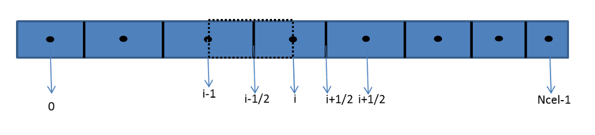

# Service line model

Up to this point, the main equations of the transient multiphase model used in the simulator have been presented. That set of equations may be regarded as the core of the simulator; however, additional features are also relevant to the complete model. One of them is the **service-line model** and the way it is coupled to the multiphase production-line model.

The multiphase model is designed with enough flexibility to accept **accessories** attached to its control volumes. Each control volume may contain one accessory only, such as an ESP, a positive-displacement pump, or a mass source. The service line behaves as a special accessory: rather than being attached to a single control volume, it is coupled to the multiphase system as a whole.

This coupling is established through **gas-lift valve models**. These valves may be distributed along the multiphase system and connected to different control volumes. The gas injection rate is determined by the pressure difference between the service line and the production line, together with the valve model. This section presents the discretized service-line model and explains how it is numerically connected to the multiphase flow model.

The service line is represented by a simple one-dimensional single-phase gas-flow model.

## Governing equations

### Gas mass conservation

$$
A\frac{\partial \rho_g}{\partial t} + \frac{\partial \dot{M}_g}{\partial x} = \frac{\Gamma_g}{\Delta L}
\label{eq:service_mass}
$$

### Gas momentum conservation

$$
\frac{\partial \dot{M}_g}{\partial t}
+ \frac{\partial (u_g \dot{M}_g)}{\partial x}
+ A\frac{\partial p}{\partial x}
=
- f\frac{\rho_g u_g |u_g|}{2}S_w
+ \rho_g g A\sin(\theta)
\label{eq:service_momentum}
$$

### Gas energy conservation

$$
\begin{equation}
\begin{aligned}
&\left[\rho_g \alpha A c_{vg}''\right]\frac{\partial T}{\partial t}
+ \rho_g \alpha A \frac{1}{z\rho_g}\left(z + T\frac{\partial z}{\partial T}\bigg|_p\right)\frac{\partial p}{\partial t}
+ \left[\rho_g \alpha A u_g c_{pg}\right]\frac{\partial T}{\partial x}
- \left[\rho_g \alpha A u_g J_g\right]\frac{\partial p}{\partial x}
+ (\rho_g \alpha A)\left(\frac{\partial \dfrac{u_g^2}{2}}{\partial t}
+ u_g^2 \frac{\partial u_g}{\partial x}\right) \\[8pt]
&= (h_{Fg} - h_g)\frac{\Gamma_g}{\Delta L}
- \left[\rho_g u_g \alpha_g + \rho_l u_l (1-\alpha)\right] A g
+ Q_w
\end{aligned}
\end{equation}
$$

Where:

- $u_g$ is the local gas velocity;
- $p$ is the pressure;
- $f$ is the Fanning friction factor;
- $\rho_g$ is the gas density;
- $S_w$ is the wetted perimeter of the pipe, defined from the hydraulic diameter;
- $g$ is the gravitational acceleration;
- $\theta$ is the angle between the pipe and the horizontal;
- $\Gamma_g$ is the gas mass source term;
- $\Delta L$ is the reference length associated with the mass source;
- $\dot{M}_g$ is the gas mass flow rate;
- $A$ is the pipe cross-sectional area;
- $t$ is time;
- $x$ is the axial coordinate along the pipe;
- $c_{vg}$ is the gas specific heat at constant volume;
- $c_{pg}$ is the gas specific heat at constant pressure;
- $T_{\mathrm{source},g}$ is the gas-source temperature;
- $z$ is the gas compressibility factor;
- $c_{vg}^{\prime\prime}$ is the effective heat capacity given by

$$
c_{vg}'' = c_{vg} + R\left(z + \frac{\partial z}{\partial T}\bigg|_p T\right)
\left(\frac{z + \dfrac{\partial z}{\partial T}\big|_p\, T}{z - \dfrac{\partial z}{\partial p}\big|_T\, p}\right);
$$

- $J_g$ is the Joule--Thomson coefficient multiplied by the gas specific heat, written as

$$
J_g = \frac{T}{z\rho_g}\left.\frac{\partial z}{\partial T}\right|_p
$$

The service-line system is considerably simpler than the multiphase production-line model presented earlier, and its numerical solution is therefore less demanding. The system contains three wave families: two associated with pressure propagation, related primarily to pressure--velocity coupling, and one associated with temperature advection, whose propagation speed is approximately the mean gas velocity.

Because the temperature-related family propagates more slowly than the pressure-related families, a **semi-implicit treatment** is attractive. Although a fully implicit solution of the service-line model would not be particularly difficult, the simulator already adopts a semi-implicit strategy for the main multiphase problem, and the same philosophy is retained here.

## Staggered-grid discretization

Using the same staggered-grid finite-volume framework adopted for the production line, the following algebraic equations are obtained.

### Discretized mass conservation

$$
\begin{equation}
A\frac{\partial \rho_g}{\partial p}\bigg|_i^k
\frac{p_i^{k+1}}{\Delta t}
+\frac{\dot{M}_g\big|_{i+\frac{1}{2}}^{k+1}}{\Delta x_i}
-\frac{\dot{M}_g\big|_{i-\frac{1}{2}}^{k+1}}{\Delta x_i}
= A\frac{\partial \rho_g}{\partial p}\bigg|_i^k
\frac{p_i^k}{\Delta t}
+\frac{\Gamma_g}{\Delta x_i}\bigg|_i^k
- A\frac{\partial \rho_g}{\partial T}\bigg|_i^k
\left[\frac{T_i^{k+1}-T_i^k}{\Delta t}\right]
\label{eq:service_mass_disc}
\end{equation}
$$

In Equation \eqref{eq:service_mass_disc}, the term associated with temporal temperature variation is treated as an iterative correction whenever it is deemed relevant. In the simulations carried out so far, this term has not shown significant influence on the solution.

### Discretized momentum conservation

The momentum equation is written at the staggered location $i+\tfrac{1}{2}$:

$$
\begin{equation}
\begin{aligned}
&\frac{\dot{M}_g\big|_{i+\frac{1}{2}}^{k+1} - \dot{M}_g\big|_{i+\frac{1}{2}}^{k}}{\Delta t}
+ 
\frac{u_g\big|_{i+1}^k
  \dfrac{\dot{M}_g\big|_{i+\frac{3}{2}}^{k+1} + \dot{M}_g\big|_{i+\frac{1}{2}}^{k+1}}{2}
  - u_g\big|_i^k
  \dfrac{\dot{M}_g\big|_{i+\frac{1}{2}}^{k+1} + \dot{M}_g\big|_{i-\frac{1}{2}}^{k+1}}{2}
}{0.5(\Delta x_i + \Delta x_{i+1})}
+ \frac{A_{i+1}+A_i}{2}
\frac{p_{i+1}^{k+1}-p_i^{k+1}}{0.5(\Delta x_i+\Delta x_{i+1})}
= \\[10pt]
&f\frac{1}{A}\frac{|u_g|}{2}S_w\bigg|_i^k
\frac{\Delta x_i}{\Delta x_i+\Delta x_{i+1}}
\frac{\dot{M}_g\big|_{i+\frac{1}{2}}^{k+1}+\dot{M}_g\big|_{i-\frac{1}{2}}^{k+1}}{2}
+ f\frac{1}{A}\frac{|u_g|}{2}S_w\bigg|_{i+1}^k
\frac{\Delta x_{i+1}}{\Delta x_i+\Delta x_{i+1}}
\frac{\dot{M}_g\big|_{i+\frac{3}{2}}^{k+1}+\dot{M}_g\big|_{i+\frac{1}{2}}^{k+1}}{2}
\\[10pt]
&+ \rho_g g\, A\sin(\theta)\big|_i^k
\frac{\Delta x_i}{\Delta x_i+\Delta x_{i+1}}
+ \rho_g g\, A\sin(\theta)\big|_{i+1}^k
\frac{\Delta x_{i+1}}{\Delta x_i+\Delta x_{i+1}}
\end{aligned}
\label{eq:service_momentum_disc}
\end{equation}
$$

Rearranging Equation \eqref{eq:service_momentum_disc} gives a linear relation among the neighboring mass-flow rates and the two adjacent pressures:

$$
\begin{equation}
\begin{aligned}
&\left[
  \frac{-u_g\big|_i^k}{4(\Delta x_i+\Delta x_{i+1})}
  - f\frac{1}{A}\frac{|u_g|}{4}S_w\bigg|_i^k
  \frac{\Delta x_i}{\Delta x_i+\Delta x_{i+1}}
\right]\dot{M}_g\big|_{i-\frac{1}{2}}^{k+1} \\[8pt]
&+\left[
  \frac{1}{\Delta t}
  + \frac{u_g\big|_{i+1}^k - u_g\big|_i^k}{4(\Delta x_i+\Delta x_{i+1})}
  - f\frac{1}{A}\frac{|u_g|}{4}S_w\bigg|_i^k
  \frac{\Delta x_i}{\Delta x_i+\Delta x_{i+1}}
  - f\frac{1}{A}\frac{|u_g|}{4}S_w\bigg|_{i+1}^k
  \frac{\Delta x_{i+1}}{\Delta x_i+\Delta x_{i+1}}
\right]\dot{M}_g\big|_{i+\frac{1}{2}}^{k+1} \\[8pt]
&+\left[
  \frac{u_g\big|_{i+1}^k}{4(\Delta x_i+\Delta x_{i+1})}
  - f\frac{1}{A}\frac{|u_g|}{4}S_w\bigg|_{i+1}^k
  \frac{\Delta x_{i+1}}{\Delta x_i+\Delta x_{i+1}}
\right]\dot{M}_g\big|_{i+\frac{3}{2}}^{k+1} \\[8pt]
&+ \frac{A_{i+1}+A_i}{2}
\frac{1}{0.5(\Delta x_i+\Delta x_{i+1})}\,p_{i+1}^{k+1}
- \frac{A_{i+1}+A_i}{2}
\frac{1}{0.5(\Delta x_i+\Delta x_{i+1})}\,p_i^{k+1} \\[8pt]
&= \frac{\dot{M}_g\big|_{i+\frac{1}{2}}^{k}}{\Delta t}
+ \rho_g g\, A\sin(\theta)\big|_i^k
\frac{\Delta x_i}{\Delta x_i+\Delta x_{i+1}}
+ \rho_g g\, A\sin(\theta)\big|_{i+1}^k
\frac{\Delta x_{i+1}}{\Delta x_i+\Delta x_{i+1}}
\end{aligned}
\label{eq:service_local_momentum}
\end{equation}
$$

Together, Equations \eqref{eq:service_mass_disc} and \eqref{eq:service_local_momentum} define the pressure--velocity coupling, which is solved through a linear system analogous to that built for the multiphase model. At each cell, the local coupled system may be represented schematically as

$$
\begin{equation}
\begin{bmatrix}
m_{0,0} & m_{0,1} & m_{0,2} & 0       & 0       \\
m_{1,0} & m_{1,1} & m_{1,2} & m_{1,3} & m_{1,4}
\end{bmatrix}_i
\begin{bmatrix}
\dot{M}_g\big|_{i-\frac{1}{2}}^{k+1} \\[4pt]
p_i^{k+1} \\[4pt]
\dot{M}_g\big|_{i+\frac{1}{2}}^{k+1} \\[4pt]
p_{i+1}^{k+1} \\[4pt]
\dot{M}_g\big|_{i+\frac{3}{2}}^{k+1}
\end{bmatrix}
=
\begin{bmatrix}
tl_0 \\[4pt]
tl_1
\end{bmatrix}_i
\label{eq:service_local_matrix}
\end{equation}
$$

After assembly over the full service line, the global system is a banded matrix with two off-diagonal couplings on each side of the main diagonal.

$$
\begin{equation}
\begin{bmatrix}
& & & \vdots & & & \\
\cdots & m_{2i-1,2i-2} & m_{2i-1,2i-1} & m_{2i-1,2i} & 0           & 0           & \cdots \\
\cdots & m_{2i,2i-2}   & m_{2i,2i-1}   & m_{2i,2i}   & m_{2i,2i+1} & m_{2i,2i}   & \cdots \\
& & & \vdots & & &
\end{bmatrix}
\begin{bmatrix}
\vdots \\[4pt]
\dot{M}_g\big|_{i-\frac{1}{2}}^{k+1} \\[4pt]
p_i^{k+1} \\[4pt]
\dot{M}_g\big|_{i+\frac{1}{2}}^{k+1} \\[4pt]
p_{i+1}^{k+1} \\[4pt]
\dot{M}_g\big|_{i+\frac{3}{2}}^{k+1} \\[4pt]
\vdots
\end{bmatrix}
=
\begin{bmatrix}
\vdots \\[4pt]
tl_{2i-1} \\[4pt]
tl_{2i} \\[4pt]
\vdots
\end{bmatrix}
\label{eq:banded}
\end{equation}
$$

Schematically:

$$
\begin{equation}
\left[
\begin{array}{ccccccccccccccccccccc}
 & & & & & & \vdots & & & & & & & & & & & & & & \\
0 & 0 & 0 & 0 & x & x & D & x & x & 0 & 0 & 0 & 0 & 0 & 0 & 0 & 0 & 0 & 0 & 0 & 0 \\
0 & 0 & 0 & 0 & 0 & x & x & D & x & x & 0 & 0 & 0 & 0 & 0 & 0 & 0 & 0 & 0 & 0 & 0 \\
0 & 0 & 0 & 0 & 0 & 0 & x & x & D & x & x & 0 & 0 & 0 & 0 & 0 & 0 & 0 & 0 & 0 & 0 \\
0 & 0 & 0 & 0 & 0 & 0 & 0 & x & x & D & x & x & 0 & 0 & 0 & 0 & 0 & 0 & 0 & 0 & 0 \\
\cdots & 0 & 0 & 0 & 0 & 0 & 0 & 0 & x & x & D & x & x & 0 & 0 & 0 & 0 & 0 & 0 & 0 & \cdots \\
0 & 0 & 0 & 0 & 0 & 0 & 0 & 0 & 0 & x & x & D & x & x & 0 & 0 & 0 & 0 & 0 & 0 & 0 \\
0 & 0 & 0 & 0 & 0 & 0 & 0 & 0 & 0 & 0 & x & x & D & x & x & 0 & 0 & 0 & 0 & 0 & 0 \\
0 & 0 & 0 & 0 & 0 & 0 & 0 & 0 & 0 & 0 & 0 & x & x & D & x & x & 0 & 0 & 0 & 0 & 0 \\
0 & 0 & 0 & 0 & 0 & 0 & 0 & 0 & 0 & 0 & 0 & 0 & x & x & D & x & x & 0 & 0 & 0 & 0 \\
0 & 0 & 0 & 0 & 0 & 0 & 0 & 0 & 0 & 0 & 0 & 0 & 0 & x & x & D & x & x & 0 & 0 & 0 \\
 & & & & & & \vdots & & & & & & & & & & & & & &
\end{array}
\right]
\end{equation}
$$

## Energy equation discretization

The discretized energy equation is advanced explicitly in temperature, while using the already updated pressure and mass-flow fields:

$$
\begin{equation}
\begin{aligned}
T_i^{k+1} &= T_i^k + \Delta t\,
\frac{
  \left\{
  \begin{array}{l}
  \displaystyle
  -\rho_g\big|A_i
  \frac{1}{z\rho_{g_i}^{k+\frac{1}{2}}}
  \left(z_i^{k+\frac{1}{2}}+T_i^k\frac{\partial z}{\partial T}\bigg|_{p_i}^{\!k+\frac{1}{2}}\right)
  \frac{p_i^{k+1}-p_i^k}{\Delta t}
  -\left[
    \rho_g\big|_i^{k+\frac{1}{2}}A_i u_{g_i}^{k+\frac{1}{2}}c_{pg}\big|_i^{k+\frac{1}{2}}
  \right]
  \dfrac{\Delta T_i^k}{\Delta x_i}+ \\[10pt]
  \displaystyle
  \left[
    \rho_g\big|_i^{k+\frac{1}{2}}A_i u_{g}\big|_i^{k+\frac{1}{2}}J_{g}\big|_i^{k+\frac{1}{2}}
  \right]
  \dfrac{p_{i+\frac{1}{2}}^{k+1}-p_{i-\frac{1}{2}}^{k+1}}{\Delta x_i} \\[10pt]
  \displaystyle
  -\!\left(\rho_g\big|_i^{k+\frac{1}{2}}A_i\right)
  \!\left(
    \frac{\dfrac{u_{g}^{2\,k+\frac{1}{2}}}{2\,i}-\dfrac{u_{g}^{2\,k}}{2\,i}}{\Delta t}
    +u_{g}^2\big|_i^{k+\frac{1}{2}}
    \frac{u_{g}\big|_{i+\frac{1}{2}}^{k+\frac{1}{2}}-u_{g}\big|_{i-\frac{1}{2}}^{k+\frac{1}{2}}}{\Delta x_i}
  \right)+ \\[10pt]
  \displaystyle
  \left[(h_{Fg}-h_g)\frac{\Gamma_g}{\Delta L}\right]_i^{k+\frac{1}{2}}
  -\left[\rho_g u_g\big|\right]A_i g
  +Q_{w_i}^{k+\frac{1}{2}}
  \end{array}
  \right\}
}{
  \left|
    \rho_g\big|_i^{k+\frac{1}{2}}A_i c_{vg}''\big|_i^{k+\frac{1}{2}}
  \right|
}
\end{aligned}
\label{eq:service_energy_disc}
\end{equation}
$$

The superscript $k+\tfrac{1}{2}$ indicates that not all variables used to evaluate a given property belong to the new time layer: pressure and mass flow rate are updated, but temperature itself is still taken from the previous iteration or previous time layer when the property is evaluated.

The temperature gradient term is computed with an upwind approximation:

If $u_{g,i}^{k+\frac{1}{2}} > 0$,

$$
\frac{\Delta T_i^k}{\Delta x_i}
=
\frac{T_i^k - T_{i-1}^k}{0.5(\Delta x_i + \Delta x_{i-1})}
\label{eq:service_upwind_positive}
$$

If $u_{g,i}^{k+\frac{1}{2}} < 0$,

$$
\frac{\Delta T_i^k}{\Delta x_i}
=
\frac{T_{i+1}^k - T_i^k}{0.5(\Delta x_i + \Delta x_{i+1})}
\label{eq:service_upwind_negative}
$$

## Boundary conditions

At the downstream end of the service line, the pipe is always assumed to be closed. If one wishes to impose a flow rate at the last control volume, this is done through a mass source term. In that case, the local matrix takes the form

$$
\begin{equation}
\begin{bmatrix}
m_{0,0} & m_{0,1} & m_{0,2} & 0 & 0 \\
0       & 0       & 1       & 0 & 0
\end{bmatrix}_{ncel}
\begin{bmatrix}
\dot{M}_g\big|_{ncel-\frac{1}{2}}^{k+1} \\[4pt]
p_{ncel}^{k+1} \\[4pt]
\dot{M}_g\big|_{ncel+\frac{1}{2}}^{k+1} \\[4pt]
0 \\[4pt]
0
\end{bmatrix}
=
\begin{bmatrix}
tl_0 \\[4pt]
0
\end{bmatrix}_{ncel}
\label{eq:service_bc_outlet}
\end{equation}
$$

At the upstream end, three types of boundary condition are available:

- imposed flow rate;
- imposed pressure;
- injection choke.

For an imposed flow rate, corresponding to a closed pipe with a source in the first volume, the local matrix becomes

$$
\begin{equation}
\begin{bmatrix}
0 & m_{0,1} & m_{0,2} & 0       & 0       \\
0 & m_{1,1} & m_{1,2} & m_{1,3} & m_{1,4}
\end{bmatrix}_i
\begin{bmatrix}
0 \\[4pt]
p_i^{k+1} \\[4pt]
\dot{M}_g\big|_{i+\frac{1}{2}}^{k+1} \\[4pt]
p_{i+1}^{k+1} \\[4pt]
\dot{M}_g\big|_{i+\frac{3}{2}}^{k+1}
\end{bmatrix}
=
\begin{bmatrix}
tl_0 \\[4pt]
tl_1
\end{bmatrix}_i
\label{eq:service_bc_inlet_flow}
\end{equation}
$$

For the injection choke, although an upstream pressure condition exists, the local matrix has the same structure as in the imposed-flow case. A choke model is first used to compute the resulting flow rate, and this value is then applied as a source term in the local matrix.

For the imposed-pressure case, the local matrix is

$$
\begin{equation}
\begin{bmatrix}
0 & 1       & 0       & 0       & 0       \\
0 & m_{1,1} & m_{1,2} & m_{1,3} & m_{1,4}
\end{bmatrix}_0
\begin{bmatrix}
0 \\[4pt]
p_0^{k+1} \\[4pt]
\dot{M}_g\big|_{\frac{1}{2}}^{k+1} \\[4pt]
p_1^{k+1} \\[4pt]
\dot{M}_g\big|_{\frac{3}{2}}^{k+1}
\end{bmatrix}
=
\begin{bmatrix}
p_{\mathrm{imposed}} \\[4pt]
tl_1
\end{bmatrix}_0
\label{eq:service_bc_inlet_pressure}
\end{equation}
$$

For this last condition, the variable $\dot{M}_{g\,|-\frac{1}{2}}^{k+1}$ is not used. Therefore, in the momentum equation at the first control volume, any average that would formally involve $\dot{M}_{g\,|-\frac{1}{2}}^{k+1}$ is replaced simply by $\dot{M}_{g\,|\frac{1}{2}}^{k+1}$.

## Coupling with the production line

Once the discretized equations have been established, it is possible to discuss how the service-line model is coupled, in transient simulations, to the production-line model. This coupling occurs in two ways:

- through the **gas-injection mass sources**;
- through the **thermal coupling** between the two lines.

### Mass-source coupling through gas-lift valves

The first coupling mechanism is through the gas-lift valves. As mentioned earlier, the service line is connected to the production line by gas-lift valves of three types: **orifice**, **Venturi**, and **pressure-operated** valves. The pressure difference between the service line and the production line determines the injected gas flow rate. In the service line, this term appears as a sink. Flow is always assumed to occur from the service line toward the production line; in practice, this means that a check valve is assumed to exist in the system.

In the simulator input file, the user specifies which service-line control volume is connected to which production-line control volume. Care must be taken in this mapping, since the simulator accepts, in principle, any correspondence between service-line and production-line volumes.

### Thermal coupling

The thermal coupling is more restrictive. The user must indicate, segment by segment, where the coupling occurs between the two pipes. This coupling is assumed to take place only inside the well. Consequently, the internal positions of the `Master1` and `Master2` valves are assumed to be coincident. In addition, the control-volume lengths of the service line and the production line must be identical in the well region.

This requirement makes the thermal coupling straightforward: each control-volume index in the service line is associated with a production-line control volume located at the same position in the well and having the same length. The heat flux in the production tubing, determined by its own internal and external conduction and convection processes --- the external term being affected by the gas flow wetting the tubing --- then feeds the annulus through which the gas flows.

### Explicit coupling strategy

The gas-lift mass-source connection is handled explicitly. The valve flow rates are evaluated before advancing the production-line solution in time. This does not usually create instability problems because the gas-lift valve diameter is small, so the resulting oscillations in injected gas mass flow rate are also small whenever pressure oscillations occur between the gas and production lines, even under subcritical-flow conditions.

If the valve diameter becomes comparable to the pipe diameter, this stability is lost. Therefore, the present model is valid only for standard gas-lift valve diameters. It is **not recommended** for simulating gas injection through large valves such as `pig-XO`; in such cases, a flow-network model would be more appropriate.

At each global time-advancement cycle in the simulator, the procedure is the following:

1. determine the time increment to be used by both the production line and the service line;
2. compute the gas flow rates through the gas-lift valves using the pressure field from the previous time layer;
3. solve the service-line problem;
4. solve the production-line problem using the updated service-line information.

Thus, the thermal coupling is also treated explicitly.

### Time-step correction

An important detail concerns the time-step correction performed when the void fraction in the production line violates its physical bounds and exceeds the interval $[0,1]$. As discussed in the previous sections, a new time increment must then be computed so that these bounds are respected.

Since the service-line system has already advanced in time by that stage, the two systems would otherwise become inconsistent. To avoid this, the service-line solution is rolled back to the state prior to the time advancement, and the service-line step is recomputed using the corrected time increment.

The coupling between the service line and the production line is therefore relatively simple. Within the assumptions and limitations described above, it does not introduce significant additional complexity and should not, by itself, cause numerical instability.